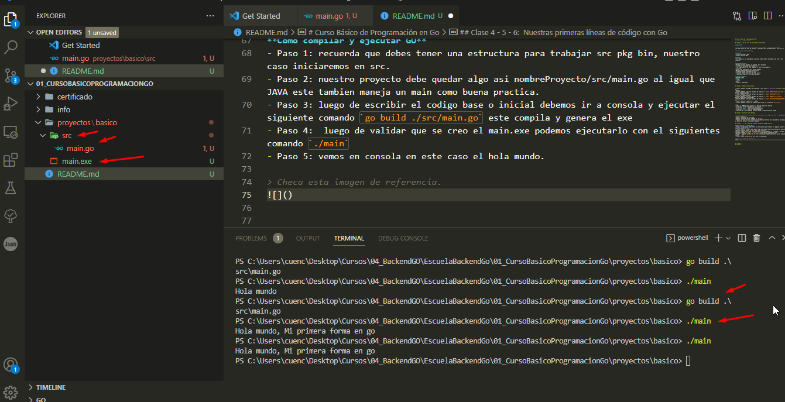

# Curso Básico de Programación en Go 
> Profesor : Osmandi Gómez

## Clase 1: ¿Qué es, por qué y quienes utilizan Go?

**¿Qué es?**

> Es un Lenguaje compilado (se recopilan los códigos) y estáticamente tipado 
(se debe indicar el tipo de variable o constante para que guarde algún valor en él)

> Se le puede llamar Go/Golang 

**Cuando**
- Anuncio Noviembre 2009
- Primera version 2012

**Creado**
- Por Google​ y sus diseñadores iniciales fueron Robert Griesemer, Rob Pike y Ken Thompson
- 

**Caracteristicas**
- Maneja procesos pesados, es potente, pero amigable.
- Se utiliza Go/Goland para nombrarlo.
- Los programadores de este lenguaje se hacen llamar gophers.
- Es veloz
- Tiene alto rendimiento para tareas pesadas
- Maneja soporte nativo por concurrencia
- Un Gopher puede ganar $74k al año
- Facilita ajustar sintaxis de forma nativa
- Comunidad receptiva, contribuye y apoya.

**¿Dónde se usa?**
- Mercado Libre
- Twich
- Twitter
- Uber
- Docker y Kubernetes

## Clase 2: Instalar Go en Linux

- Paso 1: Debemos descargar go accediendo a este acceso -> [Descarga Go](https://go.dev/dl/)
- Paso 2: 
- Paso 3: Debemos crear una variable de usuario -> `export GOPATH=/home/usuario/go` -> Entorno donde programas 
- Paso 4: Debemos crear una variable de usuario -> `export GOBIN=$GOPATH/bin`       -> Entorno del codigo Binario 
- Paso 5: Debemos crear una variable de usuario -> `export GOROOT=/usr/local/go`    -> Entorno donde esta el ejecutador 
- Paso 6: Debemos crear una variable de usuario -> `export PATH=$PATH:$GOBIN:$GOROOT/bin`    -> 
- Paso 7: source ~/.bashrc ó . . bashrc 
- Paso 8: podemos ejecutar el comando para validar la instalación `go version`

> PD: 
- mkdir -p $HOME/go/{bin,pkg,src} -> Permite generar el entorno 
- directorio *bin* -> Guarda los ejecutables 
- directorio *pkg* -> Guarda codigo dependencia 
- directorio *src* -> Aqui es donde programas  
- sudo apt-get --only-upgrade install golang -> Instalación mas rapida.

## Clase 3: Instalar Go en Windows

> Pues es sencillo solo descargando el instalador de la pagina oficial -> [Descarga Go](https://go.dev/dl/)
- Paso 1: Instalas con el wizard 
- Paso 2: Compruebo con el comando `go version`
- Paso 3: en caso de error valida las variables de entorno ya el wizard las instala pero si hay error valida o reinicia el equipo 

## Clase 4 - 5 - 6:  Nuestras primeras líneas de código con Go

**Como compilar y ejecutar GO**
- Paso 1: recuerda que debes tener una estructura para trabajar src pkg bin, nuestro caso iniciaremos en src. 
- Paso 2: nuestro proyecto debe quedar algo así nombreProyecto/src/main.go al igual que JAVA este también maneja un main como buena practica. 
- Paso 3: luego de escribir el código base o inicial debemos ir a consola y ejecutar el siguiente comando `go build ./src/main.go` este compila y genera el exe 
- Paso 4:  luego de validar que se creo el main.exe podemos ejecutarlo con el siguientes comando `./main`
- Paso 5: vemos en consola en este caso el hola mundo. 

**Otra Forma**
- Podemos ejecutar el código sin compilar pero no es recomendable 
- `go run .\src\main.go`

> Checa esta imagen de referencia. 

## Clase 5: 
## Clase 6: 