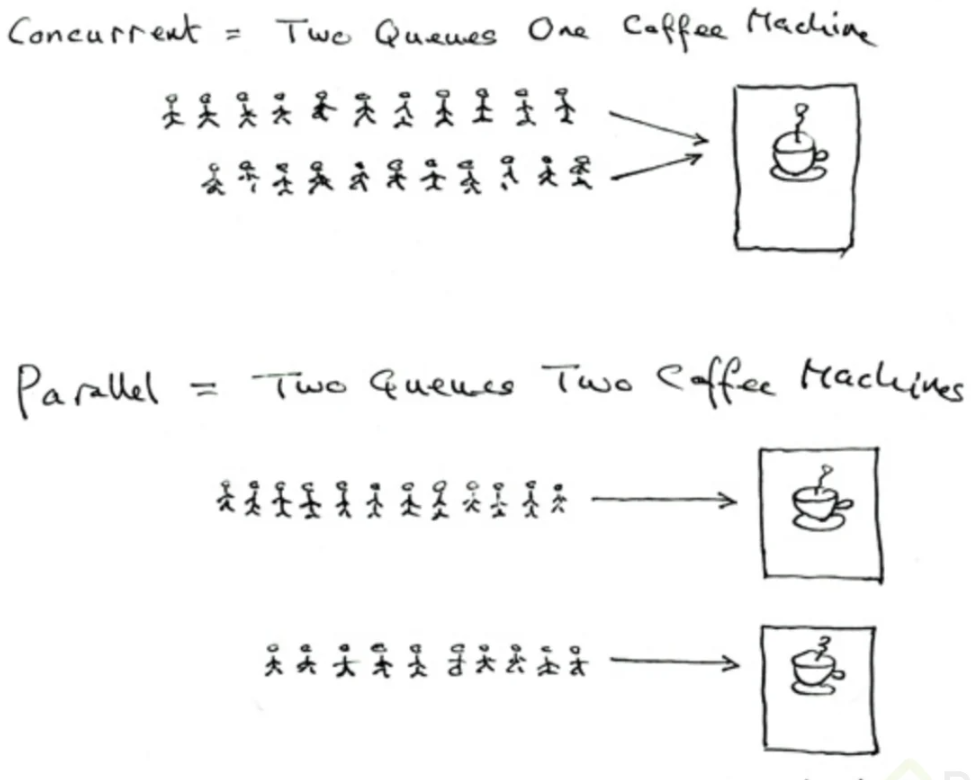

# Curso Práctico de Go: Creación de un Servidor Web 
> Profesor : Néstor Escoto

## Clase 1-2-3-4-5-6: Mi primer programa en Go

**¿Qué es?**

> Es un Lenguaje compilado (se recopilan los códigos) y estáticamente tipado 
(se debe indicar el tipo de variable o constante para que guarde algún valor en él)

> Se le puede llamar Go/Golang 

**Cuando**
- Anuncio Noviembre 2009
- Primera version 2012

**Creado**
- Por Google​ y sus diseñadores iniciales fueron Robert Griesemer, Rob Pike y Ken Thompson
- 

**Caracteristicas**
- Maneja procesos pesados, es potente, pero amigable.
- Se utiliza Go/Goland para nombrarlo.
- Los programadores de este lenguaje se hacen llamar gophers.
- Es veloz
- Tiene alto rendimiento para tareas pesadas
- Maneja soporte nativo por concurrencia
- Un Gopher puede ganar $74k al año
- Facilita ajustar sintaxis de forma nativa
- Comunidad receptiva, contribuye y apoya.
- Tenemos un compilar Online `https://go.dev/tour/moretypes/7`

**¿Dónde se usa?**
- Mercado Libre
- Twich
- Twitter
- Uber
- Docker y Kubernetes


## Clase 7: Leer inputs desde la consola 

> Para leer desde consola usamos el paquete `bufio` debemos invocarlo al y luego usarlo de esta manera

- Para este ejemplo cree una función para simplicar el uso 
```
import (
	"bufio"
	"fmt"
	"os"
)

func leeNumero() string {

	fmt.Println("Ingrese un número: ")
	//Forma de leer desde consola
	scannerSuma := bufio.NewScanner(os.Stdin)
	scannerSuma.Scan()
	numero := scannerSuma.Text()
	return numero
}

```

- Paso 1: importamos `bufio` y `os`
- Paso 2: Declaramos una variables que al mismo tiempo permite obtener lo que tecleas en consola `scannerSuma := bufio.NewScanner(os.Stdin)`
- Paso 3: Dicha variable lee y almacena lo que se teclea `scannerSuma.Scan()`
- Paso 4: extraemos de la variable scan indicandole que es un text `scannerSuma.Text()`
- Paso 5: Listo podemos mostrar lo que tecleamos en consola con un `fmt.Println("tu tecleaste", numero)`

## Clase 8: Manejo de errores y uso de If

> Sigue siendo confuso este tema pero si deseamos manejar un error al convertir valores podemos usar el paquete `strconv` y declarando una variable err podemos manejar el resultado en multiples variables ejemplo: 

```
        numero := leeNumero()
		//Valido que sea entero
		sv, err := strconv.Atoi(numero) // Aqui declaro dos variables si esta bien lo guarda en SV si esta mal lo guarda en ERR

        //Valido lo que viene en este caso si esta mal llega con nil
		if err != nil {
			fmt.Println("Valida tu teclado solo debes ingresar numero no letras")
		}
```

> Podemos manejarlo con una función general 

```
//Nota para manejar mensajes de este tipo debemos importar ""log""

func validaError(err error){
    if err != nil {
        log.Fatal("Sucedio un error tipo: ", error)
    }
}
```

## Clase 9: Mayusculas y Minusculas

> Para este caso usamos el paquete `strings` y los metodos para Mayuasculas -> `strings.ToUpper(respuestaScan)` y para Minusculas -> `strings.ToLower(respuestaScan)`
```
		//Mayusculas 
        if strings.ToUpper(respuestaScan) != "S" {
			counter++
		}
		//Minusculas  
        if strings.ToLower(respuestaScan) != "s" {
			counter++
		}
```        


## Clase 10: Switch

```
switch val {
case "a":
	fmt.Println("Case A")
case "b":
	fmt.Println("Case B")
case "c":
	fmt.Println("Case C")
default:
	fmt.Println("Invalid input")
}

//ejemplo 
func main() {
	//Imprimimos la orden al usuario
	printMenu()

	//Forma de leer desde consola
	scanner := bufio.NewScanner(os.Stdin)
	scanner.Scan()
	operacion := scanner.Text()

	switch operacion {
	case "1":
		fmt.Println("El Resultado de la suma es:", suma())
	case "2":
		fmt.Println("El Resultado de la resta es:", resta())
	case "3":
		fmt.Println("El Resultado de la multiplicación es:", multi())
	case "4":
		fmt.Println("El Resultado de la multiplicación es:", divide())
	default:
		fmt.Println("Invalid input")
	}

	fmt.Println("Adios gracias por usar la calculadora en GO!!")
}
```

## Clase 11-14 : Struct

> Uso de Struct es el equivalente de una clase 

```
package main

import "fmt"

//Genero Clase
type task struct {
	name        string
	description string
	complete    bool
}

//Genero metodo
func (t *task) checkTask() {
	t.complete = true
}

func (t *task) updateDescription(description string) {
	t.description = description
}

func (t *task) updateName(name string) {
	t.name = name
}

func main() {
	t := &task{ //Aqui creamos una referencia nueva a task
		name:        "Completar mi curso de GO",
		description: "Completar el curso de GO en esta semana",
	}
	//fmt.Println(t)
	fmt.Printf("%+v\n", t) //Permite imprimir la estructura de la clase

	t.checkTask()
	t.updateName("Finalizar curso de GO")
	t.updateDescription("Finalizar curso de GO cuanto antes")

	fmt.Printf("%+v\n", t) //Permite imprimir la estructura de la clase

}

```

## Clase 15: Uso de Slices

```
package main

import "fmt"

//Genero Clase

type taskList struct {
	tasks []*task
}

type task struct {
	name        string
	description string
	complete    bool
}

//Genero metodo
func (t *taskList) addTaskList(tl *task) {
	t.tasks = append(t.tasks, tl)
}

func (t *task) checkTask() {
	t.complete = true
}

func (t *task) updateDescription(description string) {
	t.description = description
}

func (t *task) updateName(name string) {
	t.name = name
}

func (t *taskList) deleteTask(index int) {
	t.tasks = append(t.tasks[:index], t.tasks[index+1:]...)
}

func main() {
	t1 := &task{ //Aqui creamos una referencia nueva a task
		name:        "Completar mi curso de GO",
		description: "Completar el curso de GO en esta semana",
	}
	t2 := &task{ //Aqui creamos una referencia nueva a task
		name:        "Completar mi curso de JS",
		description: "Completar este mes ",
	}
	t3 := &task{ //Aqui creamos una referencia nueva a task
		name:        "Completar mi curso de Habilidad blanda",
		description: "Completar este mes ",
	}
	t4 := &task{ //Aqui creamos una referencia nueva a task
		name:        "Completar mi curso de English",
		description: "Completar este mes ",
	}

	lista := &taskList{
		tasks: []*task{
			t1, t2, t3,
		},
	}

	fmt.Println(lista.tasks[0])
	lista.addTaskList(t4)
	fmt.Println(len(lista.tasks))
	lista.deleteTask(1)
	fmt.Println(len(lista.tasks))

}

```

## Clase 16-17 : Ciclo For 

> La mas usada es la de range pero existen 4 tipos de formas 

**Características de range:**

- Es equivalente a foreach en otros lenguajes de programación
- Regresa 2 valores: el índice de la estructura de datos y el valor contenido. En caso de no usar el índice, se puede reemplazar con un guión bajo (_).
- Éste puede iterar sobre valores de tipo string, array, slice, channel ó map.

```
// Sintaxis clásica para definir un ciclo for
for i := 0; i < len(list.tasks); i++ {
    fmt.Println("Index:", i, "task:", list.tasks[i].name)
}
```

## Clase 18: ¿Qué es una interfaz?

> En Go para decir que una clase implementa a una interfaz no es necesario hacerlo de manera explicita como otro lenguajes como c#, Java, etc. En go, se hace de manera implícita. es decir, solo necesita cumplir com las firmas que están en la interfaz.
> Las interfaces en Go simulan el comportamiento de conceptos como clases e interfaces de otros lenguajes, permitiendo también polimorfismo.
> 

```
package main

import "fmt"

func main(){

	figuras := make([]Area, 0)
	figuras = append(figuras, &Cuadrado{lado:4})
	figuras = append(figuras, &Rectangulo{lado:4, base: 6})
	figuras = append(figuras, &Triangulo{base:4, altura:10})

        // Calcular areas
	for _, f := range figuras {
		fmt.Println(f.CalcularArea())
	}

}

type Area interface {
	CalcularArea() int
}

// Cuadrado implementa Area de manera implicita
type Cuadrado struct {
	lado int
}

func (c *Cuadrado) CalcularArea() int {
	return c.lado * c.lado
}

// Rectangulo implementa Area de manera implicita
type Rectangulo struct {
	lado, base int
}

func (r *Rectangulo) CalcularArea() int {
	return r.lado * r.base
}

// Triangulo implementa Area de manera implicita
type Triangulo struct {
	base, altura int
}

func (t *Triangulo) CalcularArea() int {
	return (t.base * t.altura)/2
}
```

## Clase 19-21: ¿Qué es una interfaz?
> Los mapas son muy importantes por una sencilla razón, te permite almacenar información y luego consultarla en tiempo constante.

> Es decir si tú tienes una lista con números únicos por ejemplo, para encontrar un número, debes hacer un for e ir comparando hasta encontrar el correcto.
>Con un mapa tú ya sabes la key específica y la memoria sabe donde está ese pedacito de información, así que irá de una y te regresará el dato que buscabas.

```
package main

import "fmt"

type animal interface {
	makeSound() string
}

type dog struct{}

type cat struct{}

func (d dog) makeSound() string {
	return "Waow waow"
}

func (c cat) makeSound() string {
	return "Miau"
}

func animalMakeSound(a animal) {
	fmt.Println(a.makeSound())
}

func main() {
	cafu := dog{}
	sisa := cat{}

	animalMakeSound(cafu)
	animalMakeSound(sisa)

}

```


## Clase 22: Imprimiendo el contenido de una Página Web usando Interfaces

> usamos lo metodos de GO para poder consumir y excribir desde la web 

`
import (	"io/ioutil"	"net/http" )
`


```
package main

import (
	"fmt"
	"io/ioutil"
	"log"
	"net/http"
)

func main() {

	// Basic HTTP GET request
	resp, err := http.Get("http://www.google.com")
	if err != nil {
		log.Fatal("Error getting response. ", err)
	}
	defer resp.Body.Close()

	// Read body from response
	body, err := ioutil.ReadAll(resp.Body)
	if err != nil {
		log.Fatal("Error reading response. ", err)
	}

	fmt.Printf("%s\n", body)

}

```

## Clase 23-24-: Introducción al problema de la Concurrencia




## Clase 25-27: Channels

> Un pequeño fact es que este método de comunicación por channels, proviene de un científico llamado Tony Hoare y un concepto que llamó Comunicatin Sequential Processes (CSP) para describir patrones de interacción en sistemas concurrentes

> Básicamente los channels de go parecen tuberías o FIFOS en linux

```
data := <- c // leer de un canal c  
c <- data // enviar data a  canal c 
```

```
package main

import (
	"fmt"
	"net/http"
	"time"
)

func main() {
	inicio := time.Now()
	//Creo un canal -> usamos la palabra reservada make
	//Chan indica que es un canal
	// siempre hay que decirle que tipo de string
	canal := make(chan string)

	servidores := []string{
		"https://platzi.com/",
		"https://google.com/",
		"https://facebook.com/",
	}

	for _, servidor := range servidores {
		go revisarServidor(servidor, canal)
	}

	for i := 0; i < len(servidores); i++ {
		fmt.Println(<-canal) //Asi imprime lo que el canal devuelva
	}

	tiempoPaso := time.Since(inicio)
	fmt.Printf("Tiempo transcurrido %s\n", tiempoPaso)

}

func revisarServidor(servidor string, canal chan string) {

	_, err := http.Get(servidor)

	if err != nil {
		fmt.Println(servidor, "No esta activo =( ")
		canal <- servidor + "No esta activo =( "
	} else {
		fmt.Println(servidor, "Si esta activo =) ")
		canal <- servidor + "Si esta activo =) "
	}
}

```


