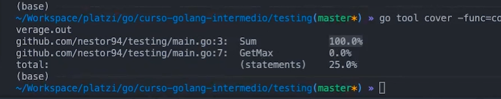
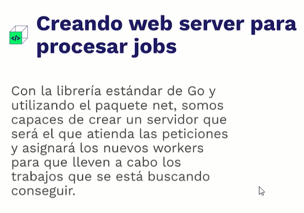

# Curso de Go Intermedio: Programación Orientada a Objetos y Concurrencia
> Profesor : Néstor Escoto

## Clase 1: Características esenciales de Go

**¿Qué es?**

> Es un Lenguaje compilado (se recopilan los códigos) y estáticamente tipado 
(se debe indicar el tipo de variable o constante para que guarde algún valor en él)

> Se le puede llamar Go/Golang 

**Cuando**
- Anuncio Noviembre 2009
- Primera version 2012

**Creado**
- Por Google​ y sus diseñadores iniciales fueron Robert Griesemer, Rob Pike y Ken Thompson
- 

**Caracteristicas**
- Maneja procesos pesados, es potente, pero amigable.
- Se utiliza Go/Goland para nombrarlo.
- Los programadores de este lenguaje se hacen llamar gophers.
- Es veloz
- Tiene alto rendimiento para tareas pesadas
- Maneja soporte nativo por concurrencia
- Un Gopher puede ganar $74k al año
- Facilita ajustar sintaxis de forma nativa
- Comunidad receptiva, contribuye y apoya.
- Tenemos un compilar Online `https://go.dev/tour/moretypes/7`
- Lenguaje compilado
- Potente librería estándar
- Manejo de concurrencia a través de GoRoutines y Channels.
- Diseñado por Google, Ken Thompson (UNIX) parte del equipo de diseño
- Muy popular en aplicaciones CLI y Backend
- Docker, Kubernetes y Terraform están escritos en Go.
- Muy utilizado para escribir malware.
- Según StackOverflow, es el tercer lenguaje mejor pagado a nivel global.
- Según StackOverflow, es la quinta tecnología mas amada por los desarrolladores y la tercera mas deseada para trabajar.
- Se maneja las variables de manera por `referenia` para evitar el duplicado de variables en memoria 


**¿Dónde se usa?**
- Mercado Libre
- Twich
- Twitter
- Uber
- Docker y Kubernetes


## Clase 2: Qué aprenderás y qué necesitas saber

**Conocimientos Requeridos**

- Declaración de variables.
- Condicionales.
- Sintaxis básica.
- Declaración de GoRoutines y Channels.
- Slices y maps.
- Apuntadores.

**¿Qué terminarás sabiendo?**
- ¿Es Go orientado a objetos?
- Cómo aplicar los conceptos de POO en Golang.
- Crear Test Unitarios en Go para aplicar TDD.
- Calcular el Code Coverage de mi proyecto.
- Análisis del Profiling en tus programas.
- Cómo multiplexar mensajes de canales.
- Técnicas para la creación de Worker Pools concurrentes.
- Crear Test Unitarios en Go para aplicar TDD.
- Crear un Job Queue concurrente

## Clase 3: Repaso general: variables, condicionales, slices y map


**Ejmeplo código**
```
package main

import (
	"fmt"
	"strconv"
)

func main() {

	var x int
	x = 8
	y := 7
	fmt.Println(x)
	fmt.Println(y)

	// Capturando valor y error
	myValue, err := strconv.ParseInt("NaN", 0, 64)

	// Validando errores de manera explicita“.
	// Nil = valor nulo
	if err != nil {
		fmt.Printf("%v\n", err)
	} else {
		fmt.Println(myValue)
	}

	// Mapa: estructura de clave valor, con Make especificar un map que mapee llaves de tipo string a valores de tipo entero
	m := make(map[string]int)
	//Key= string, 6= int
	m["key"] = 6
	fmt.Println(m["key"])

	// Slice: Estructura como un array
	s := []int{1, 2, 3}
	// Con el for recorremos el slice
	for index, value := range s {
		//index: valor en memoria que estamos accediendo
		fmt.Println(index)
		//value: valor almacenado en el slice
		fmt.Println(value)
	}
	// Agregar un valor nuevo al final del slice
	s = append(s, 16)
	for index, value := range s {
		fmt.Println(index)
		fmt.Println(value)
	}
}
```

**Ejmeplo código**
```
package main

import (
	"fmt"
	"strconv"
)

func main() {
	var x int
	x = 8
	y := 7

	fmt.Println(x)
	fmt.Println(y)

	// Handling errors
	myValue, err := strconv.ParseInt("Nan", 0, 64)
	if err != nil {
		fmt.Printf("%v\n", err)
	} else {
		fmt.Printf("%v\n", myValue)
	}

	// Map
	m := make(map[string]int)
	m["Key"] = 6
	fmt.Println(m["Key"])

	// Slice
	s := []int{1, 2, 3, 4, 5}
	for i, v := range s {
		fmt.Println(i, v)
	}

	fmt.Println()

	// Append slice
	s = append(s, 6)

	// Range
	for i, v := range s {
		fmt.Println(i, v)
	}

	fmt.Println()

	// Delete from slice
	s = append(s[:2], s[3:]...)

	// Range
	for i, v := range s {
		fmt.Println(i, v)
	}

	// Struct
	type Person struct {
		Name string
		Age  int
	}
	p := Person{"Bob", 20}
	fmt.Println(p.Name)
	fmt.Println(p.Age)

}
```

# Clase 4: Repaso general: GoRoutines y apuntadores

- Temas para dominar -> https://divan.dev/posts/go_concurrency_visualize/

**Ejmeplo código**
```
package main

import (
	"fmt"
	"time"
)

func main() {
	c := make(chan int) //Creamos un canal para monitorear las Goroutines
	go doSomething(c)   //Llamamos a la función con go para generar un Goroutine
	<-c                 //main esperara a que este canal reciba el mensaje

	g := 25
	fmt.Println(g)
	h := &g         //Apuntador a g
	fmt.Println(h)  //Dirección de memoria donde esta almacenada g
	fmt.Println(*h) //Accedemos al valor de h que a su vez almacena g
}

func doSomething(c chan int) { //Recibimos un canal de tipo int
	time.Sleep(3 * time.Second) //Poner a dormir
	fmt.Println("Done")
	c <- 1 // le envia el valor de 1
}
```

## Clase 5: ¿Es Go orientado a objetos?

**¿Es Go Orientado a objetos?**

- POO se ha convertido en uno de los paradigmas de programación predominante en la industria.
- POO puede llegar a ser muy riguroso, pero a cambio permite una alta reutiliuzación de código y la aplicación de un sinnúmero de patrones de diseño.
- Go puede alcanzar la aplicación de los conceptos de POO, pero de una forma diferente a lenguajes como Java y Python.

**GO resalta en lo siguiente**

1.- Encapsulación
	- a. Estado(“campos”)
	- b. Comportamiento (“métodos”)
	- c. Exportado & No exportado; visible & no visible
2.- Reusabilidad
	- a. herencia (“tipos embebidos”)

3.- Polimorfismo
	- a. interfaces
4.- Overriding
	- a. "promoción"
	- OOP Tradicional
5.- Clases
	- a. Estructura de dato describiendo un tipo de objeto
	- b. Puedes crear “instancias”/ “objetos” de la clase / prototipo
	- c. Las clases almacenan ambos:
		- i. estado / datos / campos
		- ii. comportamiento / métodos
	- d. público / privado
6.- Herencia
	- En Go:
	- No creas clases, creas un TIPO
	- No creas instancias, creas un VALOR de un TIPO
	- Tipos definidos por el usuario
	- Podemos declarar un nuevo tipo

**Tipos Nombrados vs Tipos Anónimos**

- Tipos anónimos son indeterminados. Aún no han sido declarados como un tipo. El compilador tiene flexibilidad con tipos anónimos. Puedes asignar un tipo anónimo a una variable declarada de cierto tipo. Si la asignación puede ocurrir, el compilador hará el trabajo de determinar el tipo; el compilador hará una conversión implícita. No puedes asignar un tipo nombrado a un tipo de diferente nombre.
- Alineamiento arquitectónico y más

**Convención: organiza tus campos lógicamente. **
- Legibilidad y claridad ganan en rendimiento como punto crítico. 
- Go será de buen rendimiento. 
- Ve primero por legibilidad. 
- Sin embargo, si estás en una situación donde necesitas darle prioridad al rendimiento: agrega los campos del más grande al de menor tamaño, por ejemplo: int 64, int32, float32, bool

## Clase 6: Structs vs. clases


**Ejmeplo código**
```
//Es la forma de generar una clase y  una instancia en go 
// Usamos Struct NO class
// usamos referncia usando * & como una instancia 

package main

import "fmt"

type Employee struct {
	id   int
	name string
}

func main() {
	e := Employee{}
	fmt.Println("%v", e)

	e.id = 1
	e.name = "Name"
	fmt.Println("%v", e)
}
```

**Concepto**
- El objetivo de una clase es definir una serie de propiedades y métodos que un objeto puede usar para
alcanzar diferentes objetivos.
- Go utiliza Structs para generar `nuevos tipos` de datos que se pueden utilizar para cumplir tareas en
específico.

**Notas**
- Es la forma de generar una clase y  una instancia en go 
- Usamos Struct NO class
- usamos referncia usando * & como una instancia 


## Clase 7: Métodos y funciones

**Concepto**
- podemos generar metodos getter y setter parecido en java 
- solo necesitamos seguir el patrón colocamos la palabra `func` seguido del nombre de la función seguido definiendo antes que tipo de valor devolvera y que tipo de valor recibirá 
- (`*`) notese el astericos hace una copia de referencia del struct 
- Algunos lenguajes de programación implementan la filosofía que TODO debe ser un objeto, sin embargo, no siempre es algo aplicable, por ejemplo, en una librería con utilidades que no pertenecen a un dominio específico
```
func (p *Employee ) setId(id int){
	p.id = id
}
```

**Ejemplo código**

```

package main
import (
	"fmt"
	// "strconv"
)

type Employee struct{

	id int
	name string
}

func main(){
	p := new(Employee)
	 
	p.setId(1)
	p.setName("Javier")
	p.getDatos()

}

func (p *Employee ) setId(id int){
	p.id = id
}

func (p Employee ) getId() int{
	return p.id 
}

func (p *Employee ) setName(name string){
	p.name = name
}

func (p Employee ) getName() string{
	return p.name
}

func (p Employee) getDatos(){
	fmt.Println(p)
}
```

## Clase 8: Constructores

**Concepto**
> Go no es 100% orientado a objectos, para hacernos una idea si Java es 95 % orientado a objetos (Recuerden que los primitivos de Java no son objectos) go es como el 50%, talvez un poco más un poco menos.


**Creando una clase**
> Para crear una clase en go utlizamos un struct y tambien debemos utilizar la palabra reservada type al comienzo de la declaración.
```
// Esta es nuestra clase con dos atributos
type Employee struct {
	id   int
	name string
}
```


**Creando un constructor**
- Pensemos en un constructor como un representante de un gran artista el cual vela por los intereses del artista que está representando.
- De igual forma el constructor de la clase vela por los intereses de la clase a la que representa, por ejemplo el constructor determina cómo es que se debe instanciar a una clase.
- Aunque el profesor mostró varios ejemplos para crear un constructor a mi me gustaron estos dos.

```
//Forma No1: Crear directamente el objeto donde se va a utilizar .
func main() {

	e1 := Employee{
		id:   14,
		name: “Esteban”,
	}
	fmt.Printf("%v\n", e1)
}

//Forma No2: Crear una función que reciba por parametro los valores que tendrá nuestro objecto , asigne los valores a sus respectivos atributos y luego devuelva una referencia en memoria del objeto creado.

func NewEmployee(id int, name string) *Employee {
	return &Employee{
		id:   id,  //Asignando valores.
		name: name,
	}
}

//Nuestra función principal
func main() {
	e2:= NewEmployee(23, "Miguel") //Instanciando nuestro objecto.
	fmt.Printf("%v\n", *e2)

}

```

**Creando métodos.**
- En simples palabras un método determina el comportamiento que tendrá un objeto. 
- Utilicemos los famosisimos métodos getters y setters

```
// Este es nuestro método set, y tenemos que indicarle que pertenece a nuestra clase Employee para ello le pasamos un puntero * que apunte a esa clase  ​para luego poder tener acceso al atributo y asignarle el valor que nos pasen a través de este método setId.
func (x *Employee) setId(i int) {
	x.id = i
}

// Este es nuestro método get, igual que el anterior pasamos un puntero * pero en este caso vamos a retornar un valor int por ello lo indicamos en la declaracion del metodo.
func (x *Employee) getId() int {
	return x.id
}

//Nuestra función principal
func main() {

	e2:= NewEmployee(23, "Miguel")
	fmt.Printf("%v\n", *e2)
	idE2 := e2.getId() // recuperamos el atributo id del objecto e2
	e2.setId(14) // Cambiamos el atributo id del objecto e2
	fmt.Printf("%d\n", idE2)
	fmt.Printf("%v\n", *e2)
}

```

## Clase 9: Herencia

**Concepto**
- Go no permite la herencia, go utiliza la `composicion`.
- La composicion, a diferencia de la herencia, no es una clase hija, sino que contiene los metodos de las clases indicadas.
- usamos la palabra reservada `type` para emular herencia 
- Cuando se tienen `receiver functions` asociadas a un struct y se forma otro struct a partir de este, los métodos también funcionan con el nuevo struct.
- Y aún contando con esa herencia de métodos puedo reescribir la receiver function en el nuevo struct solo creando una función con el mismo nombre y recibiendo el struct. Así tendría polimorfismo.

```
package main

import "fmt"

type Person struct {
	name string
	age  int
}

type Employee struct {
	id int
}

type FullTimeEmployee struct {
	Person
	Employee
}

func getMessage(p Person) {
	fmt.Printf("%s with age %d", p.name, p.age)
}

func main() {
	ftEmployee := FullTimeEmployee{}
	ftEmployee.name = "Name"
	ftEmployee.age = 2
	ftEmployee.id = 5
	fmt.Printf("%v\n", ftEmployee)
}
```

## Clase 10: interfaces 

**Concepto**
- En cambio en Go, es suficiente definir los métodos para implementar la interfaz y la implementación es implícita.
- En el polimorfismo se utiliza una interfaz (o una clase base) para determinar en tiempo de ejecución el método a utilizar, 
- Se permite acceder por medio de la interfaz en vez de hacerlo a través de un objeto en particular, porque en este último caso el método se determina en tiempo de compilación (esto no es polimorfismo).
- GO no implementa inetrfaces de manera explicita 

```
package main

import "fmt"

type Person struct {
	name string
	age  int
}

type Employee struct {
	id int
}

// Inheritance tipo anonimo
type FullTimeEmployee struct {
	Person
	Employee
	endDate string
}

type TemproaryEmployee struct {
	Person
	Employee
	taxRate float64
}

type PrintInfo interface {
	getMessage() string
}

// Composicion sobre herencia
func (ft FullTimeEmployee) getMessage() string {
	return fmt.Sprintf("Hi %s, you are %d years old. And you are a full time employee", ft.name, ft.age)
}

func (te TemproaryEmployee) getMessage() string {
	return fmt.Sprintf("Hi %s, you are %d years old. And you are a temprary employee", te.name, te.age)
}

func GetMessage(pi PrintInfo) {
	fmt.Println(pi.getMessage())
}

func main() {
	f := FullTimeEmployee{}
	f.name = "John"
	f.age = 30
	f.id = 1
	f.endDate = "2019-01-01"
	fmt.Printf("%+v\n", f)

	t := TemproaryEmployee{}
	t.name = "Mary"
	t.age = 25
	t.id = 2
	t.taxRate = 0.25
	fmt.Printf("%+v\n", t)

	//Lo que nos indica que podemos usar el mimos metodo pero implementando diferentes comportamiento 
	GetMessage(f) //-> f empleado tiempo completo 
	GetMessage(t) //-> t empleado temporal 
	//Notese que se usa el mismo metodo pero para diferentes comportamientos  logramos el comportamiento polimorfismo
}
```

## Clase 12: Aplicando interfaces con Abstract Factory

**Concepto**
- Patrón de diseño de tipo creacional que permite la producción de objetos de la misma familia o tipo sin especificar su clase correcta, permitiendo esa determinación en tiempo de ejecución
- Go te permite implementar muchos de los patrones de diseño que están basados en polimorfismo mediante la utilización de interfaces
- 


**Ejemplo código**

```
package main

import "fmt"

// SMS Email

type INotificationFactory interface {
	SendNotification()
	GetSender() ISender
}

type ISender interface {
	GetSenderMethod() string
	GetSenderChannel() string
}

type SMSNotification struct {
}

func (SMSNotification) SendNotification() {
	fmt.Println("Sending Notification via SMS")
}

func (SMSNotification) GetSender() ISender {
	return SMSNotificationSender{}
}

type SMSNotificationSender struct {
}

func (SMSNotificationSender) GetSenderMethod() string {
	return "SMS"
}

func (SMSNotificationSender) GetSenderChannel() string {
	return "Twilio"
}

type EmailNotification struct {
}

func (EmailNotification) SendNotification() {
	fmt.Println("Sending Notification via Email")
}

func (EmailNotification) GetSender() ISender {
	return EmailNotificationSender{}
}

type EmailNotificationSender struct {
}

func (EmailNotificationSender) GetSenderMethod() string {
	return "Email"
}

func (EmailNotificationSender) GetSenderChannel() string {
	return "SES"
}

func getNotificationFactory(notificationType string) (INotificationFactory, error) {
	if notificationType == "SMS" {
		return &SMSNotification{}, nil
	}

	if notificationType == "Email" {
		return &EmailNotification{}, nil
	}

	return nil, fmt.Errorf("No Notification Type")
}

func sendNotification(f INotificationFactory) {
	f.SendNotification()
}

func getMethod(f INotificationFactory) {
	fmt.Println(f.GetSender().GetSenderMethod())
}

func main() {
	smsFactory, _ := getNotificationFactory("SMS")
	emailFactory, _ := getNotificationFactory("Email")

	sendNotification(smsFactory)
	sendNotification(emailFactory)

	getMethod(smsFactory)
	getMethod(emailFactory)
}
```

## Clase 13:Funciones anónimas

- Una función anónima es una función definida internamente dentro de un bloque de código, y que no tiene identificador o nombre. Este tipo de funciones no son reutilizables como paquetes, siendo utilizadas únicamente dentro del bloque de código en el que son declaradas.
- También se pueden hacer funciones que anónimas que reciben parámetros. Solamente hay que agregar el valor del mismo en los paréntesis del final

```
package functions

import (
	"fmt"
	"time"
)

// anon func's are not very recommended for DRY purposes. Only use it when it is necessary.
func anon() {
	x := 5

	// Anonymous func 1
	y := func(x int) int {
		return x * 2
	}
	fmt.Println("y anon func: ", y(x))

	// Anonymous func 2 (it calls directly the param and calls itself)
	z := func() int {
		return x * 2
	}()
	fmt.Println("y anon func: ", z)

	// 3rd Anonymous way: lambda Goroutine in a channel
	// Create channel for blocking Gorouting until msg arrives
	c := make(chan int)
	// anon Goroutine
	go func() {
		// Exec func logic in Goroutine
		fmt.Println("Starting Goroutine anon func...")
		time.Sleep(1 * time.Second)
		fmt.Println("Goroutine ended")

		// Send int to c channel
		c <- 1
	}() // calls itself
	// Waits until receiving the msg in c channel
	<-c

}

func Functions() {
	anon()
}

```

- Una solución para no definir la función anónima dos veces, es declarandola pero no invocarla con los () al final, con esto podemos llamarla más adelante con la variable
- 
```
package main

import "fmt"

func main() {	

	x := 5
	y := func(num int) int {
		return num * 2
	}

	z := 8

	fmt.Println(y(x))
	fmt.Println(y(z))
}
```

## Clase 14 : Funciones variadicas y retornos con nombre

- Las funciones variadicas nos permiten utilizar como slices los argumentos de funciones de los cuales no sabemos su longitud exacta.

**Los retornos con nombre**
- Los retornos con nombre nos permiten definir variables antes de definir el cuerpo de la función, por lo cual utilizaremos return para devolverlos.


**Los retornos con nombre**
```
package main

import "fmt"

func sum(values ...int) int {// ( ...int ) Permite indicar que no sabremos cuantos nombre o cuantos parametros vendran y lo podemos tartar como un slices
	total := 0
	for _, num := range values {
		total += num
	}
	return total
}

func printNames(names ...string) {// ( ...int ) Permite indicar que no sabremos cuantos nombre o cuantos parametros vendran y lo podemos tartar como un slices
	for _, name := range names {
		fmt.Println(name)
	}
}

func getValues(x int) (double int, triple int, quad int) { //definimos la cantidad de retorno ojo si o si se debe usar  dentro de la función si no se declara genera error, solo se usa dentro del bloque del código 
	double = 2 * x
	triple = 3 * x
	quad = 4 * x
	return  //go interfiere que tipo de valor va devolver sin necesidad de colocarlo en el return ya que se esta aplicando `Los retornos con nombre` esto defiene en el emcabezado de la función 
}

func main() {
	fmt.Println(sum(1))
	fmt.Println(sum(1, 2))
	fmt.Println(sum(1, 2, 3, 4))
	printNames("Alice", "Bob", "Charlie", "Dave")
	fmt.Println(getValues(2))//Forma de `Los retornos con nombre`
}
```

## Clases 15: Cómo utilizar los Go modules


**Comandos**
## Inicializar un módulo
- `go mod init github.com/username/module`

## Descargar una dependencia
- `go get github.com/donvito/hellomod`  

## Limpiar dependencias sin utilizar
- `go mod tidy`

## Información de los módulos cacheados
- `go mod download -json` 

```
package main

import (
	"github.com/donvito/hellomod"
	hellomod2 "github.com/donvito/hellomod/v2"
)

func main() {
	hellomod.SayHello()
	hellomod2.SayHello("Platzi")
}
```

## Clases 17: Testing

**Como generar un testing en GO**
- Paso 1: debemos crear un archivo go con el sufijo `test` Ejemplo -> `main_test.go`
- Paso 2: tener definido que vamos a evaluar para este ejemplo usaremos este archivo -> [testing/main.go](../03_CursoIntermedio_Programacion_OrientadaObjetosConcurrencia/testing/main.go)
- Paso 3: iniciamos a escribir nuestras pruebas ejemplo de codificación -> [pruebas](../03_CursoIntermedio_Programacion_OrientadaObjetosConcurrencia/testing/main_test.go)

- Paso 4: para generar  `testing` debemos crear un `mod` para poder crearlo ejecutamos este comando `go mod init nombreModulo`
- Paso 5: usamos el comando `go test` y este nos indicará si la prueba corrio bien 


> Me apoyan a validar si me equivoque gente. 

 ## Clase 18: 

> Cobertura de código

- La cobertura de prueba es una medida utilizada para describir el grado en que se ejecuta el código fuente de un programa cuando se ejecuta un conjunto de pruebas en particular.

- Si el software que está probando contiene un total de 100 líneas de código y la cantidad de líneas de código que realmente se validan en el mismo software es 50, entonces el porcentaje de cobertura de código de este software será del 50 por ciento.

**Comandos**
**Indicador de % cubriendo las pruebas**
- `go test -cover` // Nos indica el nivel de cobertura de as pruebas 
- 

**Para generar el archivo cover**
- `go test -coverprofile=coverage.out` //Usamos este archivo para tener metricas de nuestras pruebas y saber que parte de nuetsro codigo no hay pruebas 

**ver resumen resumen en la terminal**
- `go tool cover -func=coverage.out`   //Indicamos que le eviamos las funciones de nuetsro archivo main.go, lista las funciones 
- 

**Ver resumen en el navegador**
- `go tool cover -html=coverage.out`   //genera un htm que puedes usar el navegador para validar los procesos o funciones que no se han evaluado 
- 

## Clase 19: Profiling


> Permite vizualizar el comportamiento de tus programas ejecutados y tener un resultados incluso por lineas de códigos, esto permite realizar mejoras en momento de ejcución  


**Para ver el uso de CPU del codigo que testeamos, usamos**
- `go test -cpuprofile=cpu.out` 

**Para ver el resumen del uso del CPU:**
- `go tool pprof cpu.out`

**Dentro de pprof escribimos top para ver como se han comportado los programas en nuestro test**

`
(pprof) top
Además, dentro de pprof podemos inspeccionar el tiempo promedio de ejecución de cada línea de una función, usando el comando list <nombre_funcion>
`

(pprof) list Fibonacci
Tambien podemos ver el reporte del promedio de ejecución:

en el navegador usando web
o exportarlo en pdf usando pdf
(pprof) web
(pprof) pdf

**Para salir de (pprof) puedes usar quit o Ctrl + D**

## Clase 20-21: Testing usando Mocks


> Esta tenica nos permite mockear ciertas partes de nuestro bloque de código o servicio, para que pueda ser validado por separado y no de manera conjunta. 


Existen algunas librerias que te crean ciertos mocks, un ejemplo es gomock https://github.com/golang/mock, se los recomiendo.

**Notas**
- Es muy buena! hasta que te das cuenta que solo funciona con interfaces y no con tipos
- Para usar los mosk debemos redfinir las funciones convirtiendolas en una variable = funcion ejemplo 
- para ejecutar recuerda que debes implementar un modulo `go mod init testingmod->nombre`
- Ejeuctamos luego `got test`
`
var GetPersonByDNI = func(dni string) (Person, error) {
	time.Sleep(5 * time.Second) //Emula conexion a una base de datos
	// SELECT * FROM Persona Where ...
	return Person{}, nil
}
` 

```
package main

func TestGetFullTimeEmployeeById( t *testing.T) {
	table := []struct {
		id int
		dni string
		mockFunc func()
		expectedEmployee FullTimeEmployee
	}{
		{
			id: 1,
			dni: "1",
			mockFunc: func() {
				GetEmployeeById = func(id int) (Employee, error) {
					return Employee {
						Id: 1,
						Position: "CEO",
					}, nil
				}

				GetPersonByDni = func(id string) (Person, error) {
					return Person{
						Name: "John Doe",
						Age: 35,
						DNI: "1",
					}, nil
				}
			},
		}
	}
}
```


## Clase 22: Unbuffered channels y buffered channels


**Unbuffered channel:** 
- Espera una función o una rutina para recibir el mensaje, es bloqueada por ser llamada en la misma función

**Buffered channel:** 
- Se puede llamar de manera inmediata, en el siguiente ejemplo 2 es el numero de canales que pueden ser usados

```
package main

import "fmt"

func main() {
  // c := make(chan int) // Unbuffered
  c := make(chan int, 2) // Buffered

  c <- 1
  c <- 2

  fmt.Println(<-c)
  fmt.Println(<-c)
}
```

## Clase 23: Waitgroup

Un WaitGroup espera que una colección de gorutinas terminen su trabajo. La gorutina de main llama Add para configurar el número de gorutinas por las que tiene que esperar. Luego cada una de las gorutinas corre y llama a Done cuando terminan. Al mismo tiempo, Wait puede ser usado para bloquear hasta que todas las gorutinas hayan finalizado. Escribir código concurrente es súper fácil: todo lo que tenemos que hacer es poner “go” en frente de una llamada a una función o método.


```
crea un grupo de espera que se incrementa en cada iteración, lo que
también ejecutará la función doSmth() que restará 1 del grupo de espera
después de que termine. wg.Wait() al final garantiza que esperará el wg (contador)
ser 0
runtime.NumCPU()
runtime.NumGoroutine()
sync.WaitGroup
func (wg *WaitGroup) Add(delta int)
func (wg *WaitGroup) Done()
func (wg *WaitGroup) Wait()
```

```
package main

import (
	"fmt"
	"sync"
	"time"
)

/*
crea un grupo de espera que se incrementa en cada iteración, lo que
también ejecutará la función doSmth() que restará 1 del grupo de espera
después de que termine. wg.Wait() al final garantiza que esperará el wg (contador)
ser 0
*/

func doSmth(u int, wg *sync.WaitGroup) {
	defer wg.Done()

	fmt.Printf("Started at #%d\n", u)
	time.Sleep(time.Second * 2)
	fmt.Println("Ended...")
}

func main() {

	var wg sync.WaitGroup

	for i := 0; i < 10; i++ {
		wg.Add(1)//Bloquea hasta que llegue a cero 
		go doSmth(i, &wg)
	}

	wg.Wait()
}

```

## Clase 24: Buffered channels como semáforos

> Permite administrar la canidad de rutinas para ser ejecutaas usamos semaforos para ir limitando el maximo de ser ejecutado enc ierto tiempo. 

```
package main

import (
	"fmt"
	"sync"
	"time"
)

/*
traffic light.

this uses channels and waint groups to 1. execute only 2 doSmth() func
at a time and 2. be able to wait for all of them.

in order of execution it'll:
c := [][] -- two free spaces
c := [routine1][] -- one free space
c := [rountine1][routine2] -- all occupied
c := [][routine2] -- one free space
*/

func doSmth(i int, wg *sync.WaitGroup, c chan int) {
	defer wg.Done()
	fmt.Printf("Id: %d -> started...\n", i)
	time.Sleep(time.Second * 4)
	fmt.Printf("Id: %d -> finished...\n", i)

	<- c // frees the space for new routines
}

func main() {
	c := make(chan int, 2) // creates a buffered channel with a capacity of two
	var wg sync.WaitGroup // creates wait group

	for i := 0; i < 10; i++ {
		c <- 1 // alocate a new "instance" in the free space
		wg.Add(1) // adds to the wait group
		go doSmth(i, &wg, c)
	}

	wg.Wait()
}

```

## Clase 25: Definiendo channels de lectura y escritura


>Cuando se trabaja con channels existe la gran probabilidad de crear un deadlock si no somos cuidadosos con su utilización, una forma de mitigar parte de este riesgo es definiedo canales de lectura o escritura , pero no ambos


```
package main

import "fmt"

func Generator(c chan<- int) {
	fmt.Println("in gen func-->")
	for i := 1; i <= 10; i++ {
		fmt.Println("for gen", i)
		c <- i
	}
	close(c)
}

func Double(in <-chan int, out chan<- int) {
	fmt.Println("in double func-->")
	for value := range in {
		fmt.Println("for double", value)
		out <- value * 2
	}
	close(out)
}

func Print(c chan int) {
	for value := range c {
		fmt.Println(value)
	}
}

func main() {
	generator := make(chan int)
	doubles := make(chan int)

	go Generator(generator)
	go Double(generator, doubles)
	Print(doubles)
}

```

## Clase 26: Worker pools

Los grupos de trabajadores son un modelo en el que un número fijo de n trabajadores (implementado en Go con goroutines), se abre camino a través de n tareas en una cola de trabajo (implementado en Go con un canal). 

El trabajo permanece en una cola hasta que un trabajador finaliza su tarea actual y realiza una nueva.

Básicamente hay una cantidad determinada de trabajadores y n tareas. Cada trabajador toma una tarea, y cuando la hace toma otra. Esto es muy útil para tareas frágiles que requieren mucho procesamiento.

```
package main

import "fmt"

// Worker es una función que hace el trabajo.
func Worker(id int, jobs <-chan int, results chan<- int) {
	for j := range jobs {
		fmt.Println("worker", id, "started  job", j)
		fib := Fibonnaci(j)
		results <- fib
		fmt.Println("worker", id, "finished job", j, "result", fib)
	}
}


// Fibonacci devuelve el número n en la secuencia de Fibonacci.
func Fibonnaci(n int) int {
	if n < 2 {
		return n
	}
	return Fibonnaci(n-1) + Fibonnaci(n-2)
}

func main() {
	
	// tareas por hacer
	tasks := []int{2, 3, 4, 5, 7, 10, 12, 35, 37, 40, 41, 42}

	nWorkers := 5
	jobs := make(chan int, len(tasks))
	results := make(chan int, len(tasks))

	
	// iniciar los trabajadores
	for w := 1; w <= nWorkers; w++ {
		go Worker(w, jobs, results)
	}

	
	// dar trabajo a los trabajadores
	for _, t := range tasks {
		jobs <- t
	}
	close(jobs)

	// obtener los resultados (consumir el canal)
	for a := 1; a <= len(tasks); a++ {
		<-results
	}
}
```

## Clase 27: Multiplexación con Select y Case

> Permite leer los channels dependiendo quien se ejecute en la secuencia. esto tambien permite que puedas ser selectivo para seleciconar que channel deseas que muestre


```
package main

import (
	"fmt"
	"time"
)

func doSomething(i time.Duration, c chan<- int, param int) {
	time.Sleep(i)
	c <- param
}

func main() {
	c1 := make(chan int)
	c2 := make(chan int)

	d1 := 4 * time.Second
	d2 := 2 * time.Second

	go doSomething(d1, c1, 1)
	go doSomething(d2, c2, 2)

	/* fmt.Println("Waiting for the first result")
	fmt.Println(<-c1)
	fmt.Println("Waiting for the second result")
	fmt.Println(<-c2) */

	for i := 0; i < 2; i++ {
		select {
		case res := <-c1:
			fmt.Println("Received", res, "from c1")
		case res := <-c2:
			fmt.Println("Received", res, "from c2")
		}
	}

}

```

## Clase 28: Definiendo workers, jobs y dispatchers


**Notas**
- El dispatcher recibe todos los jobs, se puede decir que es como el componente global
- Cada worker tiene su canal de jobs, y saben cual es el canal del disptacher, es decir el workerpool es el mismo canal para todos los workers.
- Cada worker esta enviando su canal al canal del dispatcher
- En la medida que el dispatcher recibe jobs este los va repartiendo entre los workers a través de sus canales


```
Explico lo que pasó en esta clase con ejemplo más criollo:

Tenemos una empresa de buses. En esta empresa tenemos:

Conductores (workers)
Rutas (Job)
Vendedores de tiquetes de bus (Dispacher)
Cada conductor (Conductor) tiene una lista de rutas (Job) que tiene que hacer.

El vendedor de tiquetes (Dispatcher), tiene una lista de todas las rutas que se ofrecen.

Cuando un cliente (Nosotros/Usuario) se acerca por un tiquete (Job), le compra al vendedor de tiquetes (Dispatcher), un tiquete para ir a otra ciudad.

Este vendedor, ya tiene una lista de tiquetes por realizar (Job), y le envía la ruta a realizar al primer conductor (Worker) que este disponible.
```


```
package project

import (
	"fmt"
	"time"
)

// Estructura de la tareas de procesar
type Job struct {
	Name   string        //Nombre de la tarea
	Delay  time.Duration //Tiempo de espera
	Number int           // Numero a procesar
}

type Worker struct {
	Id         int           // id del Worker
	JobQueue   chan Job      // Canal de tareas del worker
	WorkerPool chan chan Job //Canal de canales de tareas, este canal se comparte entre todos los workers
	QuitChan   chan bool     //Canal para parar al worker
}

type Dispatcher struct {
	WorkerPool chan chan Job //Canal de canales de tareas, este se les pasa a cada worker nuevo
	MaxWorkers int           //cantidad maxima de workers
	JobQueue   chan Job      //Canal de tareas, se puede ver como un canal global de tareas que despues se reparten entre workers
}

func NewWorker(id int, workerPool chan chan Job) *Worker {
	return &Worker{
		Id:         id,              //Se asigna un id
		WorkerPool: workerPool,      //Se le indica el canal donde tiene quie agregar su canal de tareas
		JobQueue:   make(chan Job),  //Canal de tareas del worker
		QuitChan:   make(chan bool), //Canal para parar al worker
	}
}

func (w Worker) Start() {

	//Se inicia de manera concurrente un ciclo sin fin
	go func() {
		for {

			//Al worker pool se manda el canal de worker, este se manda cada vez iteracion, es decir cuando el worker termino de hacer un jobs
			w.WorkerPool <- w.JobQueue

			//Se multiplexean los canales del worker
			select {
			case job := <-w.JobQueue:
				//Si se recibe un job en el canal de tareas del worker se ejecuta
				fmt.Printf("Worker with id %d Started\n", w.Id)
				fib := Fibonacci(job.Number)
				time.Sleep(job.Delay)
				fmt.Printf("Worker with id %d Finishes with result %d\n", w.Id, fib)

			case <-w.QuitChan:
				//Si se recibe un job en el canal de salida se para el worker (lo sca del ciclo)
				fmt.Printf("Worker with id %d Stopped\n", w.Id)
				return
			}

		}
	}()
}

//La funcion stop manda un true al canl de salida del worker
func (w Worker) Stop() {
	go func() {
		w.QuitChan <- true
	}()
}

//El dispatcher cuenta con el el canal global de jobs y un canal de todos los canales de los workers

func NewDispatcher(jobQueue chan Job, maxWorkers int) *Dispatcher {

	worker := make(chan chan Job, maxWorkers)
	return &Dispatcher{
		JobQueue:   jobQueue,
		MaxWorkers: maxWorkers,
		WorkerPool: worker,
	}
}

func (d *Dispatcher) Dispatch() {

	//Inicia de manera indefinidad a mandar jobs a los canales que se van recibiendo en el canal de caneles de jobs
	for {
		select {
		case job := <-d.JobQueue:
			go func() {
				workerJobQueue := <-d.WorkerPool
				workerJobQueue <- job
			}()
		}
	}
}

func Fibonacci(n int) int {
	if n <= 1 {
		return n
	}

	return Fibonacci(n-1) + Fibonacci(n-2)
}

```


## Clase 29: Creando web server para procesar jobs



```
package main

import (
	"fmt"
	"log"
	"net/http"
	"strconv"
	"time"
)

type Job struct {
	Name   string
	Delay  time.Duration
	Number int
}

type Worker struct {
	Id       int
	JobQueue chan Job
	QuitChan chan bool
}

func NewWorker(id int, jobQueue chan Job) *Worker {
	return &Worker{
		Id:       id,
		JobQueue: jobQueue,
		QuitChan: make(chan bool),
	}
}

func (w *Worker) Start() {
	go func() {
		for {
			select {
			case job := <-w.JobQueue:
				fmt.Println("Worker with id", w.Id, "Started")
				result := Fibonacci(job.Number)
				time.Sleep(job.Delay)
				fmt.Println("Worker with id", w.Id, "Finished with result", result)
			case <-w.QuitChan:
				fmt.Println("Worker with id", w.Id, "Terminated")
				break
			}
		}
	}()
}

func (w *Worker) Stop() {
	go func() {
		w.QuitChan <- true
	}()
}

type Dispatcher struct {
	MaxWorkers int
	JobQueue   chan Job
}

func NewDispatcher(jobQueue chan Job, maxWorkers int) *Dispatcher {
	return &Dispatcher{
		JobQueue:   jobQueue,
		MaxWorkers: maxWorkers,
	}
}

func (d *Dispatcher) Run() {
	for i := 0; i < d.MaxWorkers; i++ {
		worker := NewWorker(i, d.JobQueue)
		worker.Start()
	}
}

func Fibonacci(n int) int {
	if n < 2 {
		return n
	}

	return Fibonacci(n-1) + Fibonacci(n-2)
}

func RequestHandler(w http.ResponseWriter, r *http.Request, jobQueue chan Job) {
	if r.Method != "POST" {
		w.Header().Set("Allow", "POST")
		w.WriteHeader(http.StatusMethodNotAllowed)
	}

	delay, err := time.ParseDuration(r.FormValue("delay")) //Parseo en formato de tiempo 
	if err != nil {
		http.Error(w, "Invalid delay", http.StatusBadRequest)
		return
	}

	value, err := strconv.Atoi(r.FormValue("value"))//Pasa string a entero 
	if err != nil {
		http.Error(w, "Invalid value", http.StatusBadRequest)
		return
	}

	name := r.FormValue("name")
	if name == "" {
		http.Error(w, fmt.Sprintf("Invalid name %s", name), http.StatusBadRequest)
		return
	}

	job := Job{name, delay, value}
	jobQueue <- job
	w.WriteHeader(http.StatusCreated)
}

func main() {
	const (
		maxWorkers   = 4
		maxQueueSize = 20
		port         = ":8081"
	)

	jobQueue := make(chan Job, maxQueueSize)
	dispatcher := NewDispatcher(jobQueue, maxWorkers)
	dispatcher.Run()

	http.HandleFunc("/fibonacci", func(w http.ResponseWriter, r *http.Request) {
		RequestHandler(w, r, jobQueue)
	})

	err := http.ListenAndServe(port, nil)
	if err != nil {
		log.Fatal("Cannot run server")//Bloque la ejecución 
	}
}
```