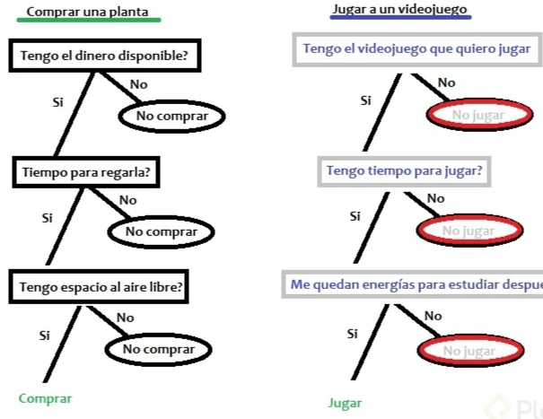

# Curso de Inteligencia Artificial: ChatGPT, DALL-E y Hugging Face
> Profesor :

## Clase 1-5: Conceptos y aplicaciones de IA

**La Inteligencia Artificial (IA):**  
- Es un campo de la informática que se ocupa de crear sistemas y programas que pueden realizar tareas que normalmente requieren inteligencia humana, como la comprensión del lenguaje natural, el razonamiento, la percepción y la toma de decisiones.

**El Machine Learning (Aprendizaje Automático)** 
- Es una técnica de IA que utiliza algoritmos para aprender a partir de datos y mejorar su rendimiento en una tarea específica sin ser programado específicamente para ello. 
- En otras palabras, el Machine Learning permite a un sistema aprender y mejorar por sí solo a medida que recibe más datos.

**El Deep Learning (Aprendizaje Profundo)**
- Es un tipo de Machine Learning que utiliza redes neuronales artificiales para aprender y resolver problemas complejos, como la clasificación de imágenes, el reconocimiento de voz y el procesamiento del lenguaje natural. 
- Estas redes neuronales están compuestas por capas de nodos que procesan la información y la transfieren a la siguiente capa para su procesamiento adicional. 
- A medida que los datos se introducen en la red, se ajustan los pesos de las conexiones entre los nodos para mejorar el rendimiento del modelo.

> En resumen, el Machine Learning es una técnica utilizada en la Inteligencia Artificial para permitir que los sistemas aprendan de los datos y mejoren su rendimiento en una tarea específica, mientras que el Deep Learning es una técnica más avanzada de Machine Learning que utiliza redes neuronales artificiales para resolver problemas complejos.


**Tipos de aprendizajes**

**Supervisado**

- tengo una variable objetivo
- Datos etiquetados
- Etiquetas
- Entrenamiento de modelo
- Predicción

- 

**No supervisado**
- No tengo una variable objetivo)
- Datos no etiquetados
- Machine learning
- Resultados (clústeres y etiquetas

- 

**Por Refuerzo**
- Es un Mix de ambas 
- Tengo un objetivo específico pero no una variable


**Aplicaciones de IA:**
- NLP
	- Procesamiento de lenguaje natural: algoritmos que simulan la comprensión semántica del lenguaje
- Visión artificial
	- Tareas de clasificación de imágenes
- Robótica
	- Asociación de movimientos para automatizar una tarea
- IA generativa
	- Clasifico lo que ya existe
	- Genero algo totalmente nuevo

## Clase 6: Data science y sub usos de IA

**¿Qué es Data Science?**
El Data Science es una disciplina que se enfoca en la obtención, limpieza, análisis y visualización de datos con el fin de obtener información valiosa para la toma de decisiones. Esta disciplina combina conocimientos de matemáticas, estadística, programación y dominio de negocio para extraer conocimiento y valor a partir de datos.

**Relación con Inteligencia Artificial**
La Inteligencia Artificial (IA) y el Data Science están estrechamente relacionados, pero no son lo mismo. Mientras que la IA se enfoca en crear máquinas capaces de realizar tareas que normalmente requieren inteligencia humana, el Data Science se enfoca en obtener información valiosa a partir de los datos.

Una de las aplicaciones más comunes de la IA es en el aprendizaje automático (Machine Learning), que es una rama del Data Science que utiliza algoritmos para aprender de los datos y mejorar su desempeño con el tiempo.

En resumen, el Data Science es una disciplina que utiliza técnicas de análisis de datos para extraer conocimiento y valor a partir de los mismos, mientras que la IA se enfoca en la creación de máquinas capaces de realizar tareas inteligentes. El Data Science es una herramienta importante para lograr la inteligencia artificial.

**Operaciones**

📈  Regresión numérica:
	- Técnica de análisis estadístico
	- Predice o estima un valor numérico desconocido
    - Basada en la relación entre variables (independiente y dependiente)
	- Construye un modelo matemático para predecir la variable dependiente


📁 Dataset:
	- Colección de datos organizados y estructurados
	- Ejemplos: registros de ventas, datos de encuestas, registros médicos, etc.
	- Incluye múltiples variables o características (numéricas o categóricas)
	- Son los datos que vamos a usar para crear los modelos de inteligencia artificial
	- Siempre va ser la fuente de entrenamiento 


🔀 Split:
	- División de un conjunto de datos en subconjuntos
	- Usado para diferentes propósitos
	- Prrmite generar los dataset, hay que separarlos para poder tener la estructura de control y de evaluación 


🚆 Train-test split:
	- Divide el dataset en dos: entrenamiento y prueba
	- Entrenamiento: ajustar parámetros del modelo
	- Prueba: evaluar el desempeño del modelo


🔄 Cross-validation split:
	- Divide el dataset en múltiples subconjuntos o “folds”
	- Modelo entrenado y evaluado varias veces
	- Útil para evaluación más robusta, especialmente con datasets limitados


## Clase 7: ¿Cómo funciona el machine learning?

**¿Cómo funciona el machine learning?**
- El machine learning es una rama de la inteligencia artificial que se enfoca en la construcción de algoritmos 
- Pueden aprender de los datos sin ser programados explícitamente. 
- Estos algoritmos pueden ser entrenados para realizar tareas específicas a través del análisis y la interpretación de los datos.

**Proceso del machine learning**
- El proceso de machine learning generalmente se divide en tres etapas: entrenamiento, validación y prueba.

**Entrenamiento**
- En la etapa de entrenamiento, el algoritmo de machine learning recibe un conjunto de datos de entrenamiento que incluye características y etiquetas. 
- Las características son atributos que describen los datos y las etiquetas son las respuestas correctas que el algoritmo debe aprender a predecir. 
- El algoritmo utiliza estos datos de entrenamiento para ajustar sus parámetros y mejorar su capacidad para hacer predicciones precisas.

**Validación**
- En la etapa de validación, el algoritmo se prueba con un conjunto de datos de validación que no se utilizaron en el entrenamiento. 
- La precisión del modelo se evalúa comparando las predicciones del modelo con las respuestas correctas en el conjunto de datos de validación. 
- Si la precisión del modelo no es satisfactoria, se ajustan los parámetros del algoritmo y se repite la etapa de entrenamiento.

**Prueba**
- En la etapa de prueba, el modelo se prueba con un conjunto de datos de prueba que es independiente del conjunto de entrenamiento y del conjunto de validación. 
- Esto permite evaluar la capacidad del modelo para hacer predicciones precisas en datos nuevos y desconocidos.

**Tipos de aprendizaje en el machine learning**
- Existen tres tipos de aprendizaje en el machine learning: supervisado, no supervisado y por refuerzo.

**Aprendizaje supervisado**
- En el aprendizaje supervisado, el algoritmo recibe un conjunto de datos de entrenamiento que incluye características y etiquetas. El objetivo del modelo es aprender a predecir las etiquetas correctas para nuevos datos en función de las características.

**Aprendizaje no supervisado**
- En el aprendizaje no supervisado, el algoritmo recibe un conjunto de datos de entrenamiento que solo incluye características y no hay etiquetas. El objetivo del modelo es encontrar patrones y estructuras en los datos y agruparlos en categorías.

**Aprendizaje por refuerzo**
- En el aprendizaje por refuerzo, el algoritmo aprende a tomar decisiones en función de la retroalimentación que recibe. El algoritmo recibe una recompensa o un castigo en función de la precisión de sus decisiones y ajusta su comportamiento para maximizar la recompensa.

**Ejemplos de aplicaciones del machine learning**
- El machine learning tiene una amplia variedad de aplicaciones en muchos campos diferentes. Algunos ejemplos incluyen la clasificación de imágenes, el análisis de sentimientos, la detección de fraude, la predicción del clima y el procesamiento del lenguaje natural.

**Notas**
- El Machine Learning NO consiste en imitar comportamientos humanos
- utilizar algoritmos basados en matemáticas para que una máquina APRENDA a imitar dichos comportamientos
- **Ejemplo** -> Enseñarle a una máquina a reconocer las características de cada fruta y que las clasifique.
- **No es** -> Crear una lista de instrucciones (algoritmo) para que una máquina clasifique peras y manzanas.
- Machine learning hace parte de la IA pero no toda la IA es machine learning. 

**¿Qué es un modelo en el contexto de machine learning? **
- Una función matemática que simplifica la complejidad del mundo real y se ajusta a los datos para hacer predicciones sobre nuevos datos.

**¿Se podría usar IA en un proceso de análisis de datos y predicciones para toma de decisiones?**
- Sí, esto se conoce como data science y en ello se utiliza machine learning.

**¿Qué es machine learning?**
- Algoritmos con base matemática para lograr que una máquina imite algún tipo de pensamiento humano.

**¿La IA puede responder preguntas de comprensión lectora sobre Don Quijote de la Mancha?**
- Verdadero, porque analizaría el texto usando procesamiento de lenguaje natural.

**¿Están en uso tecnologías de IA cuando aparecen videos en YouTube que podrían interesarnos gracias a otros videos que hemos visto?**
- Sí, esto funciona gracias a sistemas de recomendación creados con machine learning.

**¿La inteligencia artificial se limita al reconocimiento de patrones en texto, audio e imágenes?**
- Falso, abarca espectros como el aprendizaje, la resolución de problemas, el reconocimiento de patrones y la toma de decisiones.

## Clase 8: Casos de éxito y áreas de oportunidad con IA en la industria y empresas

**OPEN AI**
`Es una organización de investigación en inteligencia artificial que se centra en desarrollar tecnologías avanzadas de aprendizaje automático y crear una inteligencia artificial general (AGI) segura y beneficiosa. Empezado con Elon Musk y desarrollado por Sam Altman, Asociados 
con Microsoft Parte opensource parte privado`


**Hugging Face 🤗**
`Es una empresa que se dedica al desarrollo de software de inteligencia artificial y lenguaje natural. Es especialmente conocida por su biblioteca de aprendizaje automático de código abierto llamada Transformers, que se utiliza ampliamente en el procesamiento del lenguaje natural.`

**Deepmind revenue 🪢**
`Empresa de inteligencia artificial adquirida por Google en 2015. No publica sus ingresos, pero se sabe que ha trabajado en proyectos de aprendizaje automático para una variedad de aplicaciones, desde juegos de mesa hasta diagnósticos médicos.`


**Jasper 🤖**
`Es una plataforma de conversación basada en inteligencia artificial que permite a las empresas crear chatbots para interactuar con los clientes de manera más efectiva y eficiente`

**Stability AI 🏙️**
`Es una empresa que utiliza la inteligencia artificial y el aprendizaje automático para analizar los riesgos y la estabilidad de los mercados inmobiliarios y financieros`

**Midjourney 💾**
`Es una empresa de tecnología que se enfoca en el análisis y la gestión de datos, y ofrece servicios de análisis de datos personalizados a otras empresas.`

**Cosas que deben mejorar las IAs**
- Sesgos: Economicos, Raciales, de genero debemos trabajar en erradicar esto
- Cambio climático: Alto consumo de CO2


**Preocupaciones éticas de la inteligencia artificial**
La inteligencia artificial (IA) ha avanzado rápidamente en los últimos años, pero su creciente adopción ha generado preocupaciones éticas y morales. Algunos de los problemas más relevantes son los siguientes:

- Sesgos en los algoritmos de IA
	- Los algoritmos de IA pueden estar sesgados por la información que se les suministra. Si la información es parcial o incompleta, el algoritmo puede aprender patrones erróneos y tomar decisiones inadecuadas. Además, si los datos utilizados para entrenar un modelo de IA están sesgados hacia ciertos grupos, puede llevar a una discriminación sistemática contra otros grupos.

- Impacto ambiental del consumo de energía de la IA
	- El creciente uso de IA y la computación en la nube han llevado a un aumento del consumo de energía. El procesamiento de grandes cantidades de datos por parte de los algoritmos de IA requiere una gran cantidad de energía y puede aumentar las emisiones de gases de efecto invernadero, lo que contribuye al cambio climático.

**Beneficios y desventajas de la IA**
La IA tiene el potencial de mejorar significativamente muchos aspectos de la vida humana, pero también plantea desafíos y riesgos significativos. Algunos de los beneficios y desventajas de la IA son los siguientes:

**Beneficios de la IA**
- Automatización de tareas rutinarias
- Aumento de la eficiencia y la productividad
- Mejora de la precisión en la toma de decisiones
- Desarrollo de nuevas tecnologías y productos
- Mejora de la atención médica y el diagnóstico
- Ayuda en la lucha contra el cambio climático ????

**Desventajas de la IA**
- Riesgo de sesgo y discriminación
- Amenaza para la privacidad y la seguridad de los datos personales
- Aumento del desempleo al automatizar trabajos que anteriormente realizaban personas
- Riesgo de mal uso de la IA con fines malintencionados
- Dependencia de la tecnología y la IA
- Soluciones y mejores prácticas para abordar los problemas éticos de la IA
- Para abordar estos problemas éticos de la IA, es necesario considerar varias soluciones y mejores prácticas. Algunas de las principales soluciones y mejores prácticas son las siguientes:
	- Asegurar que los datos utilizados para entrenar a los modelos de IA sean imparciales y estén libres de sesgos.
	- Desarrollar y aplicar estándares éticos para el uso de la IA.
	- Crear regulaciones claras y efectivas para garantizar el uso ético de la IA.
	- Promover la transparencia en la toma de decisiones de la IA.
    - Fomentar la educación y la alfabetización en IA para el público en general.
    - Desarrollar tecnologías de IA que sean amigables con el medio ambiente y que minimicen el impacto en el cambio climático.


Posibles soluciones a los problemas que nos trae la IA
La IA ha demostrado ser una herramienta muy poderosa, pero también tiene sus desventajas y problemas asociados. Aquí presentamos algunas posibles soluciones para abordar estos problemas:


`Solución al problema de la contaminación por el alto uso computacional con IA
La IA requiere grandes cantidades de energía y computación, lo que puede llevar a un aumento en las emisiones de carbono y contribuir al cambio climático. A continuación, se presentan algunas posibles soluciones para abordar este problema:`

- Uso de hardware más eficiente: los desarrolladores de IA pueden diseñar hardware especializado que sea más eficiente en el uso de energía y reduzca el impacto ambiental.
- Uso de fuentes de energía renovable: las empresas pueden optar por utilizar fuentes de energía renovable para alimentar sus centros de datos y sistemas de IA.
Mejoras en los algoritmos de IA: se pueden desarrollar algoritmos más eficientes que requieran menos energía para procesar datos y ejecutar tareas.

**Solución al problema del desempleo por IA**
La automatización impulsada por la IA también puede llevar a la eliminación de empleos en algunos sectores. Para abordar este problema, aquí hay algunas posibles soluciones:

- Capacitación y reconversión laboral: las empresas pueden invertir en programas de capacitación y reconversión laboral para ayudar a los trabajadores a adquirir nuevas habilidades y adaptarse a los nuevos roles en la era de la IA.

- Enfoque en trabajos que requieren habilidades humanas únicas: en lugar de reemplazar trabajos humanos con IA, las empresas pueden centrarse en la creación de trabajos que requieran habilidades únicas que solo los humanos pueden aportar, como la empatía, la creatividad y el pensamiento crítico.

- Regulación y políticas públicas: los gobiernos pueden implementar políticas y regulaciones que incentiven a las empresas a priorizar la retención de empleos y la inversión en capacitación y reconversión laboral.


## Clase 9: ¿Qué es y cómo funciona el deep learning?

Las redes neuronales multicapa son un tipo de arquitectura de redes neuronales artificiales que consisten en varias capas de neuronas interconectadas. Estas redes se utilizan en el aprendizaje profundo o deep learning, que es una rama de la inteligencia artificial que se enfoca en el entrenamiento de algoritmos para realizar tareas complejas a través del aprendizaje por experiencia.

**Funcionamiento de las redes neuronales multicapa**
Cada capa de una red neuronal multicapa consiste en un conjunto de neuronas interconectadas que reciben entradas, las procesan y generan salidas que se utilizan como entradas para la siguiente capa. La primera capa se llama capa de entrada y la última capa es la capa de salida. Entre las capas de entrada y salida, se pueden tener una o varias capas ocultas, que son capas intermedias donde se procesan los datos para extraer características relevantes.

Las neuronas en cada capa están conectadas con las neuronas en las capas adyacentes a través de conexiones llamadas sinapsis. Cada conexión tiene un peso, que se ajusta durante el entrenamiento de la red para optimizar el rendimiento. Durante el proceso de entrenamiento, la red neuronal ajusta estos pesos para minimizar el error entre las salidas esperadas y las salidas generadas por la red.

**Relación con el deep learning**
El deep learning utiliza redes neuronales multicapa para realizar tareas complejas, como el reconocimiento de voz, la clasificación de imágenes y el procesamiento del lenguaje natural. 

Al utilizar múltiples capas de procesamiento, las redes neuronales multicapa pueden aprender patrones y características cada vez más abstractos y complejos, lo que les permite realizar tareas que antes eran imposibles para los sistemas de inteligencia artificial.

El aprendizaje profundo también utiliza técnicas como el backpropagation, que permite ajustar los pesos de las conexiones en la red para mejorar su rendimiento. Además, el deep learning se beneficia del gran volumen de datos disponibles actualmente y del poder de procesamiento de las GPUs, lo que permite entrenar redes neuronales multicapa mucho más grandes y complejas.

En resumen, las redes neuronales multicapa son una parte esencial del aprendizaje profundo o deep learning, permitiendo que los algoritmos de inteligencia artificial realicen tareas complejas y cada vez más cercanas a las capacidades humanas.

**Cómo funciona el Deep Learning**
El funcionamiento del Deep Learning se basa en la creación de modelos de redes neuronales profundas, que tienen múltiples capas interconectadas entre sí. Cada capa procesa la información que recibe de la capa anterior y la pasa a la siguiente capa hasta llegar a la capa de salida, que da la respuesta final.

Para entrenar estos modelos, se utilizan grandes cantidades de datos etiquetados que se utilizan para ajustar los pesos de las conexiones entre las neuronas. Durante el entrenamiento, el modelo aprende a identificar patrones en los datos y a hacer predicciones cada vez más precisas.


## Clase 10: ¿Cuándo utilizar y cuándo NO deep learning?


El Deep Learning es una tecnología de inteligencia artificial que ha sido utilizada con éxito en diversas aplicaciones. Sin embargo, no siempre es la mejor opción para todas las situaciones. A continuación se presentan algunas consideraciones para decidir cuándo utilizar y cuándo no utilizar el Deep Learning:

**Cuándo utilizar Deep Learning**
- Grandes conjuntos de datos: el Deep Learning puede manejar grandes conjuntos de datos, por lo que es útil cuando se tiene una gran cantidad de datos para entrenar un modelo.

- Análisis de imágenes y vídeo: el Deep Learning ha demostrado ser muy efectivo en la detección de objetos, el reconocimiento facial y otras tareas de análisis de imágenes y vídeo.

- Procesamiento del lenguaje natural: el Deep Learning se ha utilizado con éxito en la traducción de idiomas, el análisis de sentimientos y otras tareas relacionadas con el procesamiento del lenguaje natural.

- Tareas no estructuradas: el Deep Learning es útil cuando se trata de tareas no estructuradas donde no se sabe de antemano qué características son importantes.

**Cuándo NO utilizar Deep Learning**
- Conjuntos de datos pequeños: el Deep Learning puede requerir grandes conjuntos de datos para entrenar un modelo, por lo que si se dispone de conjuntos de datos pequeños, puede no ser la mejor opción.

- Problemas simples: el Deep Learning puede ser demasiado complejo para problemas simples que pueden ser resueltos por otras técnicas más simples.

- Recursos limitados: el Deep Learning puede ser muy intensivo en recursos, por lo que si no se dispone de suficiente potencia de cómputo, puede no ser factible utilizarlo.

- Tiempo de entrenamiento: el entrenamiento de modelos de Deep Learning puede ser un proceso largo y costoso, por lo que si se necesita una solución rápida, puede ser mejor utilizar técnicas más rápidas y simples.


## Clase 11: Visión artificial

**La Visión Artificial**

`La Visión Artificial es una rama de la inteligencia artificial que se enfoca en el desarrollo de sistemas capaces de interpretar, analizar y entender imágenes y videos en tiempo real. La visión artificial se utiliza en una amplia variedad de aplicaciones, incluyendo la detección de objetos, el reconocimiento de patrones, la segmentación de imágenes y la clasificación de objetos.`

**¿Cómo funciona?**
Para que un sistema de visión artificial pueda interpretar una imagen, se requiere de una serie de algoritmos y técnicas. En general, estos algoritmos se dividen en dos categorías: procesamiento de imágenes y aprendizaje automático.

	- El procesamiento de imágenes se enfoca en el preprocesamiento de las imágenes, lo que incluye operaciones como la eliminación de ruido y la mejora del contraste. 
	- Por otro lado, el aprendizaje automático se enfoca en la creación de modelos que puedan reconocer patrones y realizar tareas específicas, como la detección de objetos o la segmentación de imágenes.

**Aplicaciones de la Visión Artificial**


- Detección y clasificación de objetos: se utiliza para identificar y clasificar objetos en imágenes y videos.
- Seguimiento de objetos: se utiliza para seguir un objeto a medida que se mueve a través de una secuencia de imágenes o videos.
- Reconocimiento facial: se utiliza para identificar y autenticar a las personas basándose en sus características faciales.
- Automatización industrial: se utiliza para supervisar y controlar los procesos de producción en fábricas.
- Vehículos autónomos: se utiliza para permitir que los vehículos autónomos reconozcan objetos y tomen decisiones basadas en las imágenes capturadas por las cámaras.
- Medicina: se utiliza para detectar y diagnosticar enfermedades a través de imágenes médicas.

## Clase 12: Procesamiento de lenguaje natural: PLN

`El procesamiento de lenguaje natural (PLN) es una rama de la inteligencia artificial que se enfoca en la interacción entre las computadoras y el lenguaje humano. El objetivo del PLN es permitir que las computadoras puedan entender, interpretar y generar lenguaje natural de la misma manera que lo hacen los seres humanos.`

**Test de Turing**
El test de Turing es un experimento propuesto por el matemático y científico de la computación Alan Turing en 1950.

El objetivo del test es determinar si una máquina puede exhibir un comportamiento inteligente equivalente o indistinguible del de un ser humano. El test se realiza mediante una conversación en lenguaje natural entre una persona y una máquina, y si la persona no puede distinguir si la respuesta proviene de una máquina o de otro ser humano, se considera que la máquina ha pasado el test.

**Inteligencia artificial fuerte**
La inteligencia artificial fuerte se refiere a la idea de una inteligencia artificial que puede igualar o superar la inteligencia humana en todas las áreas cognitivas. Es decir, una máquina que es capaz de pensar, razonar, aprender y tomar decisiones de la misma manera que un ser humano. 

**Inteligencia artificial débil**
Se enfoca en solucionar tareas específicas. 


**Enfoque multimodal en IA**
Se refiere a la combinación de diferentes modalidades de entrada, como imágenes, audio y texto, para resolver problemas complejos que involucran la percepción y comprensión humana. A través de esta combinación de modalidades, se busca emular la capacidad humana de procesar información de diferentes fuentes y modalidades.

La IA multimodal ha demostrado ser efectiva en una variedad de aplicaciones, como la clasificación de imágenes y la comprensión del lenguaje natural en contextos más amplios. Por ejemplo, en lugar de depender exclusivamente del texto, la IA multimodal puede utilizar imágenes y audio para comprender el contexto y la intención detrás de las palabras.

La investigación en este campo ha avanzado en los últimos años, impulsada por la disponibilidad de grandes conjuntos de datos etiquetados y la capacidad de procesamiento mejorada de las computadoras. Además, el enfoque multimodal también está siendo utilizado en el desarrollo de sistemas de inteligencia artificial conversacionales más avanzados, que utilizan múltiples modalidades para comprender y responder a las consultas de los usuarios de manera más efectiva.

**¿Qué son los LLM ( Large Language Models)**
LLM también puede referirse a “Large Language Models” en inglés, que son modelos de lenguaje de gran escala diseñados para procesar, entender y generar lenguaje natural humano. Estos modelos utilizan técnicas de aprendizaje automático para analizar grandes cantidades de datos de texto y aprender patrones y relaciones en el lenguaje.


## Clase 13: Aprendizaje por refuerzo

**Aprendizaje por refuerzo en IA**
Es una técnica de aprendizaje automático en la que un agente aprende a tomar decisiones en un entorno complejo para maximizar una recompensa numérica. El agente debe realizar una serie de acciones para alcanzar una meta específica, mientras el entorno responde con una señal de recompensa. El objetivo es maximizar la señal de recompensa a largo plazo.

**Componentes del aprendizaje por refuerzo**
El aprendizaje por refuerzo consta de tres componentes principales:

- El agente: el agente es el programa que toma decisiones en el entorno y aprende a maximizar la recompensa.
- El entorno: el entorno es el mundo en el que el agente opera y donde las acciones del agente tienen consecuencias.
- La señal de recompensa: la señal de recompensa es una medida numérica que indica qué tan bien está haciendo el agente en una tarea dada.

**Casos de uso del aprendizaje por refuerzo**
El aprendizaje por refuerzo se ha aplicado en una variedad de campos, incluyendo:

- Juegos de estrategia: los juegos como Go, Ajedrez y Starcraft presentan un gran desafío para la IA debido a su complejidad. El aprendizaje por refuerzo ha sido utilizado para entrenar agentes que pueden competir contra humanos en estos juegos.
  
- Robótica: los robots autónomos pueden aprender a realizar tareas complejas mediante el aprendizaje por refuerzo. Por ejemplo, un robot puede aprender a caminar en un entorno desconocido a través del ensayo y error.
  
- Sistemas de recomendación: el aprendizaje por refuerzo puede utilizarse para mejorar los sistemas de recomendación. Un agente de aprendizaje por refuerzo puede seleccionar recomendaciones para un usuario basado en su historial de visualización y otros factores.
  
- Control de procesos industriales: el aprendizaje por refuerzo puede utilizarse para optimizar el control de procesos industriales, como la producción de energía, la fabricación y la agricultura.

## Clase 14-15: Usar ChatGPT 

- Crear cuenta de Open AI
- Crear cuenta DAll-e

## Clase 16: Árboles de juego: la escuela de Turing

Los árboles de juego son una técnica utilizada en inteligencia artificial para modelar juegos complejos y estratégicos, como el ajedrez o el póker. 

Un árbol de juego es una estructura de datos que representa todas las posibles jugadas y resultados de un juego en una serie de nodos y ramas.

Cada nodo del árbol representa un estado del juego, mientras que cada rama representa una jugada posible que lleva a un nuevo estado del juego. Los algoritmos de búsqueda de árboles se utilizan para analizar los árboles de juego y determinar la mejor jugada posible para un jugador en cada estado del juego.

**Turing y la inteligencia como solucionador de problemas**
- Alan Turing, uno de los padres fundadores de la informática y la inteligencia artificial, propuso la idea de que la inteligencia humana es esencialmente un proceso de resolución de problemas. 
- En su artículo de 1950 “Computing Machinery and Intelligence”, propuso la prueba de Turing, que se utiliza para evaluar la capacidad de una máquina para mostrar un comportamiento inteligente similar al humano.

- Según Turing, la inteligencia humana se puede modelar como un proceso de resolución de problemas, donde el objetivo es encontrar la mejor solución posible a un problema en un conjunto dado de posibilidades. 
  
- Los árboles de juego en inteligencia artificial son una aplicación directa de esta idea, ya que se utilizan para modelar juegos que son esencialmente problemas de toma de decisiones.

- La creación de un árbol de juego es una forma de resolver problemas en un contexto específico, ya que implica la identificación y evaluación de posibles soluciones. 
  
- Al explorar las posibles jugadas, el árbol de juego permite a la máquina identificar la mejor estrategia para ganar el juego.

- Los árboles de juego se utilizan en una variedad de aplicaciones de inteligencia artificial, incluyendo juegos de mesa, estrategias militares, finanzas y planificación de proyectos.

## Clase 17 : Regresión lineal simple

**Nota**
- Es una técnica que nos ayuda a predecir un valor desconocido 
- Debemos encontrar la variable dependiente 

**Caracteristicas**
- La regresión lineal simple es una técnica de aprendizaje supervisado utilizada en inteligencia artificial para predecir valores continuos en función de una variable independiente. 
- Es un método estadístico que se utiliza para modelar la relación lineal entre dos variables, una variable independiente (X) y una variable dependiente (Y).
- La regresión lineal simple asume que la relación entre las dos variables se puede modelar mediante una línea recta. 
- El objetivo de la regresión lineal simple es encontrar la ecuación de la línea recta que mejor se ajuste a los datos, lo que permite predecir el valor de Y para cualquier valor dado de X.

**Funcionamiento de la regresión lineal simple**
- Para implementar la regresión lineal simple en IA, se utiliza un conjunto de datos de entrenamiento que contiene valores de la variable independiente (X) y la variable dependiente (Y). 
- El objetivo es encontrar la ecuación de la línea recta que mejor se ajuste a los datos de entrenamiento.
- Para encontrar la ecuación de la línea recta, se utiliza un algoritmo de optimización que minimiza la suma de los errores al cuadrado entre los valores reales de Y y los valores predichos por la línea recta. 
- La pendiente y la intersección de la línea recta se ajustan iterativamente hasta que se minimiza la suma de los errores al cuadrado.
- Una vez que se ha encontrado la ecuación de la línea recta, se puede utilizar para predecir el valor de Y para cualquier valor dado de X. 
- Esto permite utilizar la regresión lineal simple en IA para predecir valores continuos y realizar análisis de tendencias.

**Ejemplo de regresión lineal simple**
- Un ejemplo de regresión lineal simple es predecir la cantidad de energía consumida en función de la temperatura ambiente. 
- El conjunto de datos de entrenamiento podría incluir valores de la temperatura ambiente (X) y la cantidad de energía consumida (Y) en diferentes momentos del día.
- Una vez que se ha encontrado la ecuación de la línea recta que mejor se ajusta a los datos de entrenamiento, se puede utilizar para predecir la cantidad de energía consumida para cualquier temperatura dada. 
- Esto permite a los usuarios planificar mejor su consumo de energía y optimizar sus costos de energía.

## Clase 18 : Árboles de decisión

```
Los árboles de decisión son una técnica utilizada en inteligencia artificial para modelar decisiones complejas y tomar decisiones basadas en múltiples criterios. Un árbol de decisión es una estructura de datos que representa todas las posibles decisiones y resultados de un proceso de toma de decisiones en una serie de nodos y ramas.

Cada nodo del árbol representa un punto de decisión en el proceso, mientras que cada rama representa una opción posible que lleva a un nuevo nodo de decisión o a un resultado final. Los algoritmos de construcción de árboles de decisión se utilizan para analizar los datos y construir árboles que representan las decisiones óptimas en función de múltiples criterios.

Los árboles de decisión se utilizan en una amplia variedad de aplicaciones en inteligencia artificial, incluyendo la toma de decisiones empresariales, el diagnóstico médico y la detección de fraude.
```

**Funcionamiento de los árboles de decisión**

El funcionamiento de los árboles de decisión comienza con un conjunto de datos de entrenamiento que contiene múltiples variables de entrada y una variable de salida que indica el resultado esperado. El objetivo es construir un árbol de decisión que modele la relación entre las variables de entrada y la variable de salida.

El algoritmo de construcción de árboles de decisión comienza dividiendo los datos de entrenamiento en subconjuntos más pequeños en función de los valores de una variable de entrada. Luego, se calcula una medida de impureza para cada subconjunto, que indica la homogeneidad de los valores de la variable de salida en ese subconjunto.

El algoritmo selecciona la variable de entrada que proporciona la mejor división de los datos en subconjuntos más homogéneos y crea un nodo de decisión en el árbol que representa esa variable de entrada. Luego, el algoritmo repite este proceso para cada subconjunto hasta que se alcance un estado final en el que todas las variables de entrada se hayan utilizado y se hayan creado todos los nodos de decisión necesarios.

Una vez que se ha construido el árbol de decisión, se puede utilizar para tomar decisiones en función de los valores de las variables de entrada. Para tomar una decisión, se sigue la ruta en el árbol que corresponde a los valores de las variables de entrada y se llega a un nodo final que indica el resultado esperado.

**Ejemplo de árbol de decisión**

Un ejemplo de árbol de decisión es la detección de spam en correos electrónicos. El conjunto de datos de entrenamiento podría incluir múltiples variables de entrada, como el remitente, el asunto y el contenido del correo electrónico, y una variable de salida que indica si el correo electrónico es spam o no.

El algoritmo de construcción de árboles de decisión se utilizaría para analizar los datos de entrenamiento y construir un árbol de decisión que modele la relación entre las variables de entrada y la variable de salida. Luego, el árbol de decisión se puede utilizar para clasificar nuevos correos electrónicos como spam o no spam en función de las variables de entrada.





## Clase 19 : Hugging Face 101: modelos

**Hugging Face**
```
Hugging Face es una plataforma de código abierto que se centra en el desarrollo de tecnologías de procesamiento del lenguaje natural (NLP, por sus siglas en inglés) y aprendizaje automático. En su sitio web, https://huggingface.co/, se pueden encontrar varios modelos de NLP pre-entrenados que se pueden utilizar para diversas tareas, como la traducción automática, la respuesta a preguntas, la generación de texto y la clasificación de texto.
```

Los modelos pre-entrenados de Hugging Face se basan en la arquitectura de “Transformers”, que es una técnica de aprendizaje profundo ampliamente utilizada para el procesamiento de lenguaje natural. Estos modelos se entrenan en grandes cantidades de datos de texto para mejorar su capacidad de comprensión del lenguaje natural y luego se pueden ajustar o fine-tunear para tareas específicas.

**En el sitio web de Hugging Face, se pueden encontrar varios modelos pre-entrenados populares, incluyendo:**

- BERT (Bidirectional Encoder Representations from Transformers): un modelo pre-entrenado de NLP que se utiliza para una amplia variedad de tareas, como la clasificación de texto, la extracción de entidades y la generación de texto.
- GPT-2 (Generative Pre-trained Transformer 2): un modelo pre-entrenado de generación de texto que se utiliza para la creación de texto automático y la redacción asistida.
- RoBERTa (Robustly Optimized BERT Pretraining Approach): un modelo pre-entrenado de NLP que se basa en la arquitectura de BERT pero con mejoras en la técnica de pre-entrenamiento.
- T5 (Text-to-Text Transfer Transformer): un modelo pre-entrenado de NLP que se utiliza para una amplia variedad de tareas de texto a texto, como la traducción automática, la respuesta a preguntas y la generación de texto.

Estos modelos pre-entrenados de Hugging Face se pueden utilizar en diversas aplicaciones de NLP y aprendizaje automático, y se pueden ajustar o fine-tunear para tareas específicas. En resumen, Hugging Face es una plataforma de código abierto que ofrece modelos pre-entrenados de NLP avanzados y herramientas de software para el procesamiento del lenguaje natural y el aprendizaje automático.

**Listas de Modelos**
- https://huggingface.co/
- https://huggingface.co/google/vit-base-patch16-224
- https://huggingface.co/nlpconnect/vit-gpt2-image-captioning
- https://huggingface.co/Helsinki-NLP/opus-mt-en-es
- https://huggingface.co/runwayml/stable-diffusion-v1-5
- https://huggingface.co/facebook/bart-large-cnn

## Clase 20 : Hugging Face 101: Spaces

Spaces es una función relativamente reciente de Hugging Face que permite a los usuarios crear y compartir entornos de trabajo colaborativos para el procesamiento del lenguaje natural. Los Spaces de Hugging Face están diseñados para simplificar la colaboración en proyectos de NLP y permitir a los equipos trabajar juntos en tiempo real en tareas de procesamiento de lenguaje natural.

Los Spaces permiten a los usuarios crear entornos de trabajo personalizados y configurarlos con los recursos necesarios, como modelos de lenguaje pre-entrenados, conjuntos de datos de NLP y herramientas de software. Los usuarios pueden trabajar juntos en tiempo real en los proyectos de NLP, lo que facilita la colaboración y la comunicación entre los miembros del equipo.

Los Spaces de Hugging Face también incluyen herramientas para la gestión de versiones y la implementación de modelos de NLP, lo que facilita la integración de los proyectos de NLP en aplicaciones y servicios en línea.

Además, los Spaces de Hugging Face cuentan con una amplia comunidad de usuarios y desarrolladores que comparten recursos y colaboran en proyectos de NLP. Los usuarios pueden acceder a la comunidad de Hugging Face para obtener ayuda y compartir conocimientos, lo que facilita el aprendizaje y la mejora continua en el procesamiento del lenguaje natural.

En resumen, los Spaces de Hugging Face son una función de colaboración diseñada para simplificar el trabajo en equipo en proyectos de procesamiento del lenguaje natural, y ofrecen herramientas y recursos para la gestión de versiones, la implementación de modelos y la colaboración en tiempo real.

**Listas de modelos**
- https://huggingface.co/spaces/stabilityai/stable-diffusion
- https://huggingface.co/spaces/timbrooks/instruct-pix2pix
- https://huggingface.co/spaces/PKUWilliamYang/VToonify
- https://huggingface.co/spaces/PKUWilliamYang/VToonify
- https://huggingface.co/spaces/fffiloni/spectrogram-to-music

## Clase 21 : Hugging Face 101: soluciones especializadas

Hugging Face ofrece varias herramientas y recursos para crear y utilizar modelos de procesamiento del lenguaje natural (NLP) en producción. Aquí hay algunos pasos generales para crear modelos de NLP en producción con

**Listas de modelos**
- https://huggingface.co/autotrain
- https://huggingface.co/inference-endpoints
- https://platzi.com/cursos/hugging-face/

## Clase 22 : ¿Por qué es importante el álgebra lineal para IA?

El álgebra lineal es una rama de las matemáticas que se enfoca en el estudio de los sistemas de ecuaciones lineales y las transformaciones lineales. Es una herramienta fundamental para la inteligencia artificial (IA) y el aprendizaje automático (ML) por varias razones:

Representación de datos: Muchas aplicaciones de IA y ML procesan grandes cantidades de datos que se representan como matrices o vectores. El álgebra lineal proporciona las herramientas para manipular y transformar estos datos en formas útiles para el análisis.
Aprendizaje automático: Los algoritmos de aprendizaje automático se basan en la optimización de funciones objetivo, que se pueden expresar en términos de ecuaciones matriciales. El álgebra lineal permite la manipulación y resolución de estas ecuaciones para optimizar el rendimiento del modelo.
Redes neuronales: Las redes neuronales son un tipo de modelo de aprendizaje profundo que se basan en la combinación lineal de entradas ponderadas para generar una salida. El álgebra lineal proporciona las herramientas para la implementación y optimización de las operaciones matriciales que subyacen en la computación de las redes neuronales.
Análisis de componentes principales: El análisis de componentes principales (PCA) es una técnica de reducción de dimensionalidad que se utiliza para simplificar conjuntos de datos complejos. Se basa en la transformación lineal de la matriz de covarianza de los datos. El álgebra lineal es esencial para la implementación y comprensión del PCA.
En resumen, el álgebra lineal es importante para la IA y el ML porque proporciona las herramientas matemáticas necesarias para representar y manipular datos, optimizar modelos, implementar redes neuronales y reducir la dimensionalidad de los datos.


## Clase 23 : ¿Por qué es importante el cálculo para IA?

El cálculo es una rama de las matemáticas que se enfoca en el estudio del cambio y la continuidad. Es una herramienta fundamental para la inteligencia artificial (IA) y el aprendizaje automático (ML) por las siguientes razones:

**Optimización de funciones**
Los modelos de IA y ML a menudo se basan en la optimización de funciones objetivo. El cálculo proporciona las herramientas para encontrar los puntos críticos de una función, como los mínimos y máximos, y para determinar si estos puntos son puntos de inflexión o puntos de silla. Esto es importante para encontrar los valores óptimos de los parámetros del modelo.

**Derivadas e integrales**
Las derivadas e integrales son conceptos fundamentales del cálculo y se utilizan en muchas aplicaciones de IA y ML. Por ejemplo, las derivadas se utilizan en el cálculo del gradiente de una función objetivo, que es esencial en el aprendizaje automático basado en gradientes, como el aprendizaje profundo. Las integrales se utilizan en la estimación de densidades de probabilidad y en la inferencia bayesiana.

**Series de Taylor**
Las series de Taylor son una herramienta importante en el análisis y la aproximación de funciones complejas. Se utilizan en muchas aplicaciones de IA y ML, como el cálculo de gradientes de funciones no diferenciables y la aproximación de funciones de pérdida.

**Redes neuronales**
Las redes neuronales son un tipo de modelo de aprendizaje profundo que se basan en la combinación lineal de entradas ponderadas para generar una salida. El cálculo proporciona las herramientas para la implementación y optimización de las operaciones matemáticas que subyacen en la computación de las redes neuronales.

En resumen, el cálculo es importante para la IA y el ML porque proporciona las herramientas matemáticas necesarias para optimizar funciones, calcular gradientes, aproximar funciones complejas y implementar redes neuronales.


## Clase 24: ¿Por qué es importante la estadística y probabilidad para IA?

**Bloque Mátematicas**
- **Álgebra** : Nos ayuda estructurar de forma númerica los objetos que tenemos que usar de estudio para entrenar algoritmos. 
- **Cálculo** : Nos ayuda optimizar un proceso de predicción y de inferencia. este proceso no es perfecto trae incertidumbre. 
- **Estadísticas** : Nos ayuda como organizar, recopilar y analizar información usando métodos matemáticos, tenemos dos ramas de las estaditicas una llamada inferencial y descriptiva.  

## Clase 25: Ética en inteligencia artificial: contexto y definiciones

**Ética de los datos en IA**
- En la actualidad, la inteligencia artificial (IA) está transformando rápidamente la forma en que vivimos y trabajamos. 
- El poder de la IA radica en su capacidad para analizar grandes cantidades de datos y encontrar patrones, lo que a su vez nos permite tomar decisiones más informadas y precisas. 
- Sin embargo, esta capacidad también puede presentar riesgos éticos, especialmente en lo que se refiere a la privacidad y la discriminación.

**¿Qué es la ética de los datos?**
- La ética de los datos se refiere a los principios éticos que deben aplicarse a la recopilación, el análisis y el uso de datos. 
- En el contexto de la IA, esto se refiere a cómo se utilizan los datos para entrenar y mejorar los modelos de IA, así como a cómo se utilizan los resultados de los modelos de IA para tomar decisiones en la vida real.

**Problemas éticos en la IA**
La IA puede presentar varios problemas éticos relacionados con los datos, como los siguientes:

**Privacidad**
- La privacidad es una preocupación importante en la IA, ya que los modelos de IA suelen requerir grandes cantidades de datos para su entrenamiento. 
- La recopilación y el uso de datos personales pueden ser una invasión de la privacidad y puede exponer información personal de las personas a terceros sin su consentimiento.

**Discriminación**
- La IA puede ser susceptible a la discriminación, especialmente si los datos utilizados para entrenar los modelos están sesgados. 
- Si un modelo de IA se entrena con datos sesgados, es posible que el modelo reproduzca el sesgo en sus resultados, lo que puede llevar a decisiones discriminatorias.

**Transparencia**
- La transparencia es otro problema ético en la IA, ya que los resultados de los modelos de IA pueden ser difíciles de entender. 
- Si los resultados de un modelo de IA no son transparentes, es posible que no se pueda explicar por qué se tomó una decisión, lo que puede socavar la confianza en el modelo.

**Responsabilidad**
- La responsabilidad es otro problema ético en la IA, especialmente cuando se trata de decisiones importantes que afectan a las personas. 
- Si un modelo de IA toma una decisión equivocada o perjudicial, es importante que haya una forma de responsabilizar a los responsables.

**Conclusión**
- La ética de los datos es un problema importante en la IA, 
- Puede tener un impacto significativo en la privacidad, la discriminación, la transparencia y la responsabilidad. 
- Es importante que se apliquen principios éticos sólidos a la recopilación, el análisis y el uso de datos en la IA para garantizar que la tecnología se utilice de manera justa y responsable.

## Clase 26: Dilemas éticos en inteligencia artificial

**Dilemas éticos en inteligencia artificial**
- La inteligencia artificial (IA) se ha convertido en una herramienta poderosa y ampliamente utilizada en diversas industrias y campos, desde la salud hasta la seguridad nacional. 
- Sin embargo, a medida que la IA se vuelve más sofisticada y omnipresente, surgen una serie de dilemas éticos que deben ser abordados. 

**Sesgos y discriminación**
- Los algoritmos de IA se entrenan con datos, y si esos datos contienen sesgos y discriminación, la IA también reflejará estos prejuicios. 
- Por ejemplo, si un algoritmo de IA se entrena con datos históricos que contienen prejuicios raciales o de género, el algoritmo también puede mostrar estos prejuicios en sus decisiones. 
- Esto puede llevar a decisiones injustas y discriminación, lo que puede ser perjudicial para los individuos y las comunidades afectadas.

**Privacidad y seguridad**
- La IA a menudo se utiliza para recopilar, almacenar y analizar grandes cantidades de datos personales. 
- Si estos datos no se manejan adecuadamente, pueden poner en peligro la privacidad y seguridad de las personas. 
- La falta de medidas de seguridad adecuadas o la recopilación de datos sin el consentimiento informado de las personas pueden conducir a la violación de los derechos de privacidad.

**Responsabilidad y transparencia**
- A medida que la IA se vuelve más sofisticada, se vuelve más difícil rastrear cómo se toman las decisiones y quién es responsable de esas decisiones. 
- La falta de transparencia en el proceso de toma de decisiones puede llevar a la falta de responsabilidad, lo que puede ser peligroso para los individuos y la sociedad en general.

**Creación de empleo y automatización**
- La IA también puede tener un impacto significativo en el empleo, especialmente en aquellos trabajos que son susceptibles a la automatización. 
- Si bien la automatización puede aumentar la eficiencia y reducir los costos, también puede llevar a la pérdida de empleos y a la creación de una brecha económica. 
- Esto puede tener un impacto significativo en la sociedad, especialmente en aquellos que ya enfrentan desigualdades económicas y sociales.

**Conclusiones**
- La IA es una herramienta poderosa que puede tener un impacto significativo en la sociedad. 
- Sin embargo, también puede plantear una serie de dilemas éticos que deben abordarse. 
- La eliminación de los sesgos y la discriminación, la protección de la privacidad y la seguridad de los datos personales, la transparencia y la responsabilidad en la toma de decisiones, y el impacto en el empleo y la economía son solo algunos de los dilemas éticos que deben considerarse al implementar la IA. Es importante abordar estos dilemas éticos de manera proactiva y responsable para asegurar que la IA se use de manera justa y ética.

## Clase 27: Data4Good 

**¿Qué es Data4Good?**
- Data4Good es un término que se utiliza para referirse a la utilización de datos con fines sociales y de beneficio público. 
- Se trata de un enfoque que utiliza datos y tecnología para resolver problemas sociales, ambientales y económicos, y mejorar la vida de las personas.

**La importancia del Data4Good**
- El Data4Good es una herramienta poderosa que puede ayudar a abordar algunos de los mayores desafíos que enfrenta la sociedad actualmente. 
- A través de la recopilación, análisis y uso de datos, se pueden encontrar soluciones innovadoras a problemas complejos, como la pobreza, el cambio climático, la desigualdad, la salud y la educación.

**Ejemplos de Data4Good**
	- **Algunos ejemplos de proyectos de Data4Good incluyen:**
		- El análisis de datos climáticos para predecir y mitigar los efectos del cambio climático.
		- La utilización de la inteligencia artificial y el aprendizaje automático para mejorar la atención médica y prevenir enfermedades.
		- El uso de datos para mejorar la calidad de la educación y la toma de decisiones educativas.
		- La aplicación de datos para prevenir la violencia y el crimen en las ciudades.

**Ética en Data4Good**
- Es importante destacar que, aunque el Data4Good tiene como objetivo mejorar la vida de las personas, también puede plantear desafíos éticos y de privacidad de los datos. 
- Por esta razón, es fundamental que cualquier proyecto de Data4Good se realice con transparencia, responsabilidad y respeto a los derechos humanos y la privacidad de los datos.

> Piensa en crear una aplicación que te guste mucho y que consideres que este haciendo un cambio social a partir de los datos, que sea un ejemplo o un referente para ti en Data for Good. 

Conclusion
En resumen, Data4Good es una herramienta poderosa para abordar problemas sociales y mejorar la vida de las personas. Sin embargo, es importante tener en cuenta que cualquier proyecto de Data4Good debe abordar los desafíos éticos y de privacidad de los datos para garantizar que se utilice de manera responsable y con el respeto adecuado por las personas y sus derechos.

## Clase 28: ¿Qué nos depara el futuro con IA?


**La responsabilidad en el futuro de la IA**
- La Inteligencia Artificial (IA) ha experimentado un gran avance en los últimos años y su impacto en la sociedad es cada vez más evidente. 
- A medida que se desarrollan nuevas tecnologías, es importante tener en cuenta la responsabilidad que se tiene en su uso y el impacto que esto puede tener en la sociedad.

**La tercera revolución industrial**
- El avance de la IA ha sido comparado con la tercera revolución industrial, ya que se espera que tenga un impacto tan grande en la sociedad como lo tuvieron la primera y la segunda revolución industrial. 
- La IA tiene el potencial de transformar la forma en que trabajamos, vivimos y nos relacionamos entre nosotros.

**Responsabilidad en el uso de la IA**
- Es importante tener en cuenta que la IA no es una herramienta neutral, sino que puede ser utilizada de formas positivas y negativas. Por lo tanto, es fundamental que la comunidad científica, las empresas y los gobiernos trabajen juntos para establecer políticas y regulaciones éticas que guíen su uso.

**Ética y transparencia en la IA**
- La ética y la transparencia en el uso de la IA son elementos clave para garantizar que se utilice de manera responsable. 
- La comunidad científica y las empresas deben trabajar para desarrollar sistemas de IA éticos y transparentes que garanticen la privacidad y seguridad de los datos, la no discriminación y la responsabilidad en caso de errores.

**Educación y formación**
- La educación y la formación son fundamentales para garantizar que la IA se utilice de manera responsable. 
- Es necesario que los estudiantes de hoy en día estén preparados para trabajar con la IA y entiendan su impacto en la sociedad.

**Conclusiones**
- En conclusión, el futuro de la IA está en nuestras manos y es nuestra responsabilidad asegurarnos de que se utilice de manera responsable y ética. La tercera revolución industrial ya está aquí y su impacto en la sociedad será cada vez más evidente en los próximos años. Es importante trabajar juntos para establecer políticas y regulaciones éticas y garantizar la privacidad y seguridad de los datos, la no

## Clase 29: Reflexiones y cierre