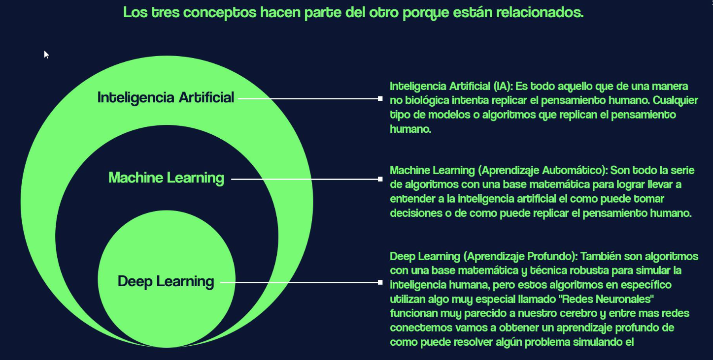
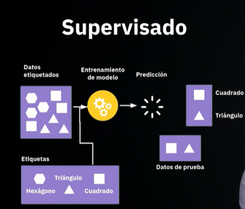
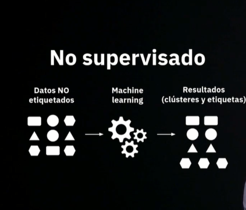
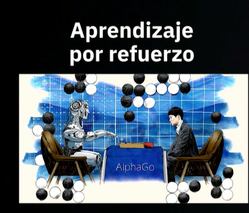
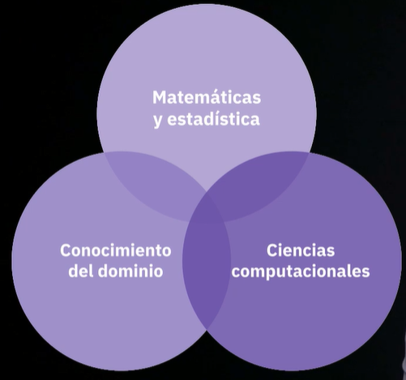

# Curso de Inteligencia Artificial: ChatGPT, DALL-E y Hugging Face
> Profesor :

## Clase 1-5: Conceptos y aplicaciones de IA

**La Inteligencia Artificial (IA):**  
- Es un campo de la informática que se ocupa de crear sistemas y programas que pueden realizar tareas que normalmente requieren inteligencia humana, como la comprensión del lenguaje natural, el razonamiento, la percepción y la toma de decisiones.

**El Machine Learning (Aprendizaje Automático)** 
- Es una técnica de IA que utiliza algoritmos para aprender a partir de datos y mejorar su rendimiento en una tarea específica sin ser programado específicamente para ello. 
- En otras palabras, el Machine Learning permite a un sistema aprender y mejorar por sí solo a medida que recibe más datos.

**El Deep Learning (Aprendizaje Profundo)**
- Es un tipo de Machine Learning que utiliza redes neuronales artificiales para aprender y resolver problemas complejos, como la clasificación de imágenes, el reconocimiento de voz y el procesamiento del lenguaje natural. 
- Estas redes neuronales están compuestas por capas de nodos que procesan la información y la transfieren a la siguiente capa para su procesamiento adicional. 
- A medida que los datos se introducen en la red, se ajustan los pesos de las conexiones entre los nodos para mejorar el rendimiento del modelo.

> En resumen, el Machine Learning es una técnica utilizada en la Inteligencia Artificial para permitir que los sistemas aprendan de los datos y mejoren su rendimiento en una tarea específica, mientras que el Deep Learning es una técnica más avanzada de Machine Learning que utiliza redes neuronales artificiales para resolver problemas complejos.

**Tipos de aprendizajes**

**Supervisado**

- tengo una variable objetivo
- Datos etiquetados
- Etiquetas
- Entrenamiento de modelo
- Predicción

- 

**No supervisado**
- No tengo una variable objetivo)
- Datos no etiquetados
- Machine learning
- Resultados (clústeres y etiquetas

- 

**Por Refuerzo**
- Es un Mix de ambas 
- Tengo un objetivo específico pero no una variable

**Aplicaciones de IA:**
- NLP
	- Procesamiento de lenguaje natural: algoritmos que simulan la comprensión semántica del lenguaje
- Visión artificial
	- Tareas de clasificación de imágenes
- Robótica
	- Asociación de movimientos para automatizar una tarea
- IA generativa
	- Clasifico lo que ya existe
	- Genero algo totalmente nuevo

## Clase 6: Data science y sub usos de IA

**¿Qué es Data Science?**
El Data Science es una disciplina que se enfoca en la obtención, limpieza, análisis y visualización de datos con el fin de obtener información valiosa para la toma de decisiones. Esta disciplina combina conocimientos de matemáticas, estadística, programación y dominio de negocio para extraer conocimiento y valor a partir de datos.

**Relación con Inteligencia Artificial**
La Inteligencia Artificial (IA) y el Data Science están estrechamente relacionados, pero no son lo mismo. Mientras que la IA se enfoca en crear máquinas capaces de realizar tareas que normalmente requieren inteligencia humana, el Data Science se enfoca en obtener información valiosa a partir de los datos.

Una de las aplicaciones más comunes de la IA es en el aprendizaje automático (Machine Learning), que es una rama del Data Science que utiliza algoritmos para aprender de los datos y mejorar su desempeño con el tiempo.

En resumen, el Data Science es una disciplina que utiliza técnicas de análisis de datos para extraer conocimiento y valor a partir de los mismos, mientras que la IA se enfoca en la creación de máquinas capaces de realizar tareas inteligentes. El Data Science es una herramienta importante para lograr la inteligencia artificial.

**Operaciones**

📈  Regresión numérica:
	- Técnica de análisis estadístico
	- Predice o estima un valor numérico desconocido
    - Basada en la relación entre variables (independiente y dependiente)
	- Construye un modelo matemático para predecir la variable dependiente

📁 Dataset:
	- Colección de datos organizados y estructurados
	- Ejemplos: registros de ventas, datos de encuestas, registros médicos, etc.
	- Incluye múltiples variables o características (numéricas o categóricas)
	- Son los datos que vamos a usar para crear los modelos de inteligencia artificial
	- Siempre va ser la fuente de entrenamiento 

🔀 Split:
	- División de un conjunto de datos en subconjuntos
	- Usado para diferentes propósitos
	- Prrmite generar los dataset, hay que separarlos para poder tener la estructura de control y de evaluación 

🚆 Train-test split:
	- Divide el dataset en dos: entrenamiento y prueba
	- Entrenamiento: ajustar parámetros del modelo
	- Prueba: evaluar el desempeño del modelo

🔄 Cross-validation split:
	- Divide el dataset en múltiples subconjuntos o “folds”
	- Modelo entrenado y evaluado varias veces
	- Útil para evaluación más robusta, especialmente con datasets limitados

