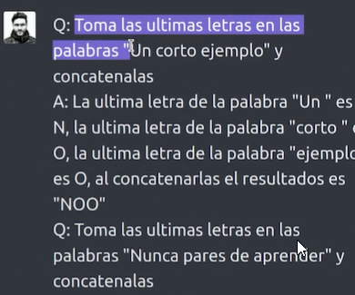
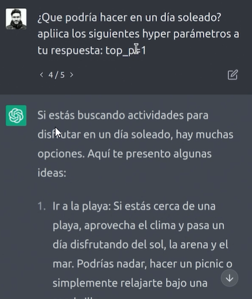
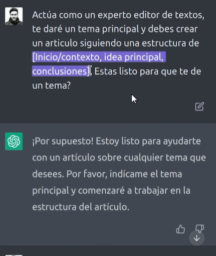
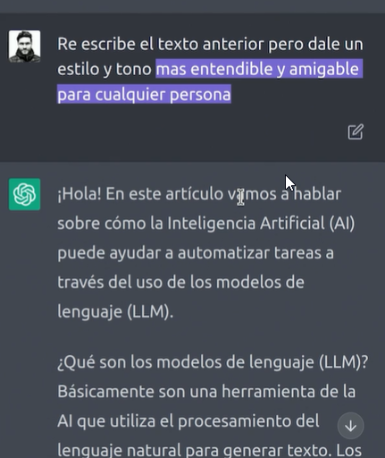
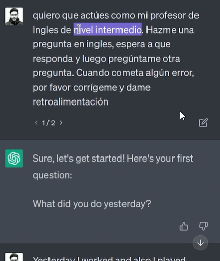
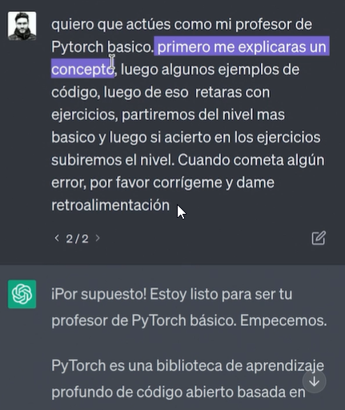
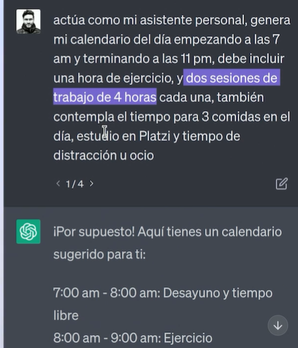
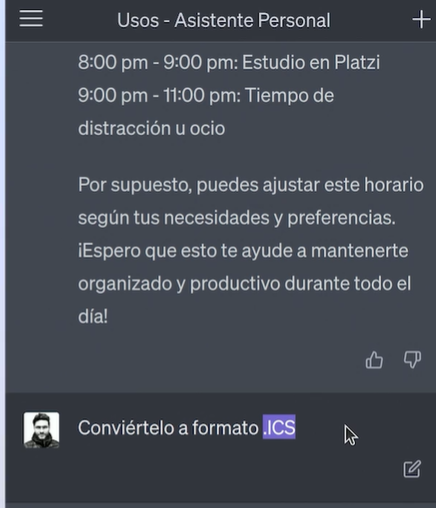

# Curso de Prompt Engineering con ChatGPT

## Clase 1. ChatGPT para prompt engineering

- Herramienta con múltiples usos en múltiples sectores de la economía digital
- Marketing, negocios, software, etc.
- Pueden ayudar con múltiples usos y funciones.
- Aprenderemos diseño de prompts para comunicarnos mejor con esta IA.


- Recuerda que su base inicia desde el 21 de Settiembre del 2021 ahi inicia el desarrollo. 

## CLASE 2: ¿Para qué usar ChatGPT y prompt engineering? 

**Prompt que es?**
> Son conjunto de instrucciones que nos permite comunicarnos con el servicio de IA, 
para que pueda ejecutar una tarea, ya que se usa LPN lenguaje de programación natural, 
el servicio interpreta esta orden y nos devuelve un resultado aproximado a lo descripto. 

- PD es importante señalar que mientras mas preciso sea tu orden o comunicación esta sera mas acertada. 


**Diferentes usos**

- Resumen de información
- Redacción de textos
- Asistencia personal virtual
- Redactar código de programación
- Toma de decisiones
- Chatbot de atención al cliente
- Todo lo que requiera texto o comprensión de lenguaje se puede optimizar con los distintos modelos de PLN

**Aprenderemos a diseñar preguntas o instrucciones para comunicarnos de manera efectiva con estas IA**
- Prompt: Instrucción a la IA
- Tienen cabida en todos los sectores de la industria
	- Marketing
	- Negocios
	- Software


**ADVERTENCIA**
- Nunca pongas información sensible o confidencial en ChatGPT

**Prompt engineering** 
En si no se considera una ingenieria ya que no es una disciplina, es mas una técnica que Abarca una amplia gama de habilidades y técnicas que son útiles para interactuar con LLM (Large Language Models)"

## Clase 3: Tu primera conversación con ChatGPT

Hola me puedes ayudar en describir los pasos para instalar laravel y usarlo para un servicio web api
¡Claro que sí! Aquí te describo los pasos para instalar Laravel y crear un servicio web API:

Requisitos previos: Antes de instalar Laravel, asegúrate de tener instalado PHP en tu computadora. Puedes descargar la última versión de PHP en el sitio web oficial de PHP. También necesitarás tener instalado Composer, un administrador de paquetes para PHP. Puedes descargar Composer en getcomposer.org.

Instalar Laravel: Una vez que tienes PHP y Composer instalados, puedes instalar Laravel usando Composer. Abre una terminal o línea de comandos y escribe el siguiente comando:

javascript
Copy code
composer global require laravel/installer
Este comando descargará e instalará la última versión de Laravel.

Crear un nuevo proyecto Laravel: Para crear un nuevo proyecto de Laravel, abre una terminal o línea de comandos y navega hasta la carpeta en la que deseas crear el proyecto. Luego, escribe el siguiente comando:

arduino
Copy code
laravel new nombre-de-tu-proyecto
Este comando creará un nuevo proyecto de Laravel con el nombre que hayas elegido.

Crear una nueva ruta API: Para crear una nueva ruta API, abre el archivo routes/api.php en tu editor de texto favorito y agrega la siguiente línea:

javascript
Copy code
Route::get('/ruta', function () {
    return '¡Hola, mundo!';
});
Esta ruta responderá a las solicitudes GET a /ruta y devolverá el texto "¡Hola, mundo!".

Ejecutar el servidor de desarrollo: Para ejecutar el servidor de desarrollo de Laravel, abre una terminal o línea de comandos, navega hasta la carpeta raíz de tu proyecto de Laravel y escribe el siguiente comando:

Copy code
php artisan serve
Este comando ejecutará el servidor de desarrollo de Laravel y podrás acceder a tu aplicación en http://localhost:8000.

Probar la ruta API: Abre un navegador web y visita la URL http://localhost:8000/api/ruta. Deberías ver el texto "¡Hola, mundo!" en tu navegador.

¡Eso es todo! Ahora tienes un servicio web API básico en Laravel. Puedes seguir agregando más rutas y funcionalidades para construir una aplicación web completa.

## Clase 4: Cómo hablarle a ChatGPT: estructura de un prompt ACTOR

> Podemos decirle al chat que actue la palabra clave es decirle **Actua**

**Instrucciones**
- Comparar
- Contrasta
- Comillas dobles para enfatizar

**Ejemplo**
- **Actua** como un experto en historia del arte  **compara** y **contrasta** las pinturas "la ultima cena " de Leonardo y "El Guernica" de pablo Piccasso 
- **Eres un experto en control** del tiempo. Créame un horario semanal que incluya 4 horas de estudio diarias, con las materias de estudio: matemáticas, inglés y programación. Incluye la forma de estudio pomodoro. Necesario tiempo de ejercicio y descanso y 8 horas de trabajo. Sácamelo en una tabla
- Hola, por favor, Redacta un mensaje de agradecimiento  a tus compañeros de trabajo por la ayuda brindad en un proyecto reciente, usa une stilo formal 
- Diseña un logotipo para una empresa de tecnologia llamada innocatech, que refleje innovacion y mejora continua, desribe los colores en formas utilizadas
- Actua como un experto de gimnasio, creame una rutina diaria de hora y media, donde el enfoque sea fuerza y para trabajar piernas, muestrame el resultado en una tabla con nombre de cada ejercicio tiempo duración y explicación de cada ejercicio para un hombre de 34 años de edad y peso de 70 kilos 

**Estructura del Prompt:**

- Instrucción: una tarea o instrucción específica que desea que el modelo realice
- Contexto: puede implicar información externa o contexto adicional que pueda dirigir el modelo hacia mejores respuestas
- Datos de entrada: es la entrada o pregunta para la que estamos interesados en encontrar una respuesta
- Indicador de salida: indica el tipo o el formato de la salida.

>**PD**
- No todos los componentes son necesarios para un aviso y el formato depende de la tarea en cuestión
- No hace falta estar acertado en ortografía o typo


## Clase 5: Limitaciones y uso ético de ChatGPT

**Falta de comprensión profunda**
- Por ejemplo, en la instrucción del nutricionista él no entiende de problemas físicos ni mentales, solo satisface la estructura de texto que yo le dé
- No sabe interpretar sentimientos
- Respuestas plausibles pero incorrectas. Existen alucinaciones ya que siempre hay cierto grado de incertidumbre.
- Si no tienes un criterio para cierto tema, no es recomendable usar el chat.
- Sensibilidad al sesgo. Porque estos algoritmos se entrenan con datos de internet. El algoritmo puede tener sesgos raciales, económicos, étnicos.
- Vulnerabilidad a manipulación. Están entrenados para no apoyar acciones relacionadas con el mal. Sin embargo, hay técnicas para saltarse esos filtros.
- Respuestas largas y repetitivas. Sobre entrenados.
- Dificultad en mantener contexto. En conversaciones largas.
- Actualización en tiempo real. Bases de datos desactualizadas.
- Máximo de tokens. Límite de palabras al recibir y al generar.

## Clase 6: Protección de datos confidenciales al usar ChatGPT

- No compartas información personal identificable con el chatbot. Evita compartir información como tu nombre completo, dirección, número de seguro social, número de tarjeta de crédito o cualquier otra información que pueda identificarte personalmente.
- No compartas información que esté protegida bajo un acuerdo de confidencialidad (ADC), acuerdo de no divulgación (en inglés Non-Disclosure Agreement o NDA). Esto podría meterte en problemas y afectar a la empresa u organizaciones con las que colabores.
- Ten cuidado con la información médica. Esta información es especialmente sensible y debe manejarse con precaución. Consulta con tu profesional de la salud para compartir información sobre tus condiciones médicas, medicamentos o tratamientos con ChatGPT.
- Evita compartir contraseñas. Los chatbots no necesitan esa información para proporcionarte ayuda.
- No compartas información financiera como números de cuenta o información de tarjetas de crédito o débito.
- Asegúrate de estar en un entorno seguro. Evita utilizar ChatGPT en redes públicas o abiertas de Wi-Fi. Utiliza una conexión segura y privada, como una red Wi-Fi doméstica, una conexión celular o una VPN.
- Revisa los términos y condiciones de uso de ChatGPT. Asegúrate de leer los términos y condiciones de uso de ChatGPT y comprende cómo se maneja y protege tu información. Si tienes preguntas o inquietudes, ponte en contacto con el equipo de soporte de ChatGPT.

## Clase 7:  Tips básicos para mejorar un prompt

1.- Comienza simple:
	- Es recomendable comenzar con indicaciones simples para validar que el modelo sea capaz de generar lo que necesito, y poco a poco ir agregando elementos y contexto para ir obteniendo un resultado cada vez más preciso. Esto es útil cuando se tiene una tarea grande que se puede dividir en subtareas más simples.

2.- Especificidad:
	- Ser muy específico en la instrucción que se le pide al modelo: cuanto más detalle se otorgue, se generarán mejores resultados. Los detalles deben ser relevantes y contribuir a la tarea en cuestión, siempre teniendo en cuenta la limitación de la cantidad de texto de entrada.

3.- Evitar imprecisiones:
	- Es importante no caer en ambigüedades al redactar los prompts. Hay elementos que pueden ser subjetivos entre lo que considero que significan y lo que el modelo puede considerar que significa (por ejemplo, utilizar “breve/extenso”, “poco/mucho”). Es mejor especificar al máximo (por ejemplo con valores numéricos) a qué nos referimos con estos elementos.

4.- Reafirma:
	- Resulta útil, al final de los prompts, preguntarle al modelo si entendió lo que debe realizar para obligarle a comenzar su respuesta con la confirmación textual de lo que debe realizar. Así nos aseguramos que esté haciendo lo que le pedimos y podremos detectar si necesitamos añadir mayor precisión.

5.- Audiencia objetivo:
	- En los casos en los que sea posible, podemos indicar una audiencia objetivo para garantizar mayor precisión en la manera en que el resultado debe ser generado (por ejemplo: para explicarle a un niño, a un estudiante universitario, a un experto en el tema).

6.- Proporcionar ejemplos:
	- Proporcionar ejemplos en el prompt sobre cómo queremos que sea el resultado, es muy efectivo para obtener respuestas muy ajustadas a formatos específicos.
	
## Clase 8: Errores comunes al escribir un prompt
	
- Extenderse demasiado o escribir vagamente. Redundar.
- Jergas o ambigüedad. Instrucciones muy anichadas.
- Limitaciones del modelo. 
- Instrucciones sesgadas. 
- Respuestas no precisas por cantidad de texto.
- Supuestos. Falta de variables.

## Clase 9: Zero-shot y One-shot Prompting

#Técnicas para el uso de prompt

> Las técnicas Zero-shot, One-shot y Few-shot son utilizadas en todos los modelos de Inteligencia Artificial: no están limitadas a los modelos de generación de texto.

- **Zero-shot**: Se refiere a la capacidad de un modelo para realizar una tarea por sí solo, sin necesidad de entrenamiento previo, utilizando solo una breve descripción de la tarea y sin necesidad de ejemplos o contextos.
- Ejemplo: “Diseña 10 preguntas de deletro para un niño de 7 años.”
ㅤ
- **One-shot**: Se refiere a la capacidad de un modelo para realizar una tarea después de haberle proporcionado solamente un ejemplo que le ayude a ejecutar la instrucción.
- Ejemplo: “Diseña 10 preguntas de deletro para un niño de 7 años. Sigue el siguiente ejemplo:
- "¿Cómo se escribe la palabra del animal que ladra?"
ㅤ
- **Few-shot**: Se refiere a la capacidad de un modelo para realizar una tarea después de haber entrenada con algunos pocos ejemplos.
- Ejemplo: “Diseña 10 preguntas de deletro para un niño de 7 años. Sigue los siguientes ejemplos:
- "¿Cómo se escribe la palabra del animal que ladra?"
- "¿Cómo se escribe la fruta dulce y roja que crece en los árboles?"

**Ejemplo** ->  One-shot o few-shot -> chat esta entrenado para que no uses estas técnicas
Tu objetivo es escribir o redactar correos electronicos con base al estilo y tono de los ejemplos que te dare a continuación:
Ejemplo 1:"" 
Ejemplo 2:""
Ejemplo 3:""
Ejemplo 5:""

## Clase 10: Chain-of-Thought Prompting

> Esta es la manera de mejorar la precisión en tareas de razonamiento aritmético, en las que los modelos de lenguaje suelen tener bastantes dificultades para resolver correctamente.

**Chain-of-Thought** 
- Es un método que permite mejorar las habilidades de razonamiento de los modelos de lenguaje. 
- El concepto de esta técnica, se basa en permitirle a los modelos descomponer un problema de varios pasos en pasos intermedios y así resolver problemas que no se podrían resolver con métodos de prompts estándar
- Una cadena de pensamiento podría realizarse por pasos. 
- Definir pasos específicos comenzando con el paso número 1 y que siga el mismo planteamiento que le indicaría. 
- Muchas veces, con decirle que está mal, corrige por sí misma el modelo. 

**Ejemplo**



## Clase 11: Optimizar resultados con estructuras de texto específicas

**Tipoas Salidas
- **Tablas**         -> Crea una TABLA con el top de software y librerías para el uso del AI. Incluye las SIGUIENTES COLUMNAS : Nombre, Descripción, categoría, link, si es open sources o no.
- **csv**            -> Crea una TABLA con el top de software y librerías para el uso del AI. Incluye las SIGUIENTES COLUMNAS : Nombre, Descripción, categoría, link, si es open sources o no. un formato .CSV.
- **Markdown - Maps mentales**       ->  Menciona los conocimientos básicos que debo tener para trabajar en ciencia de datos. Usa un MAPA MENTAL CON LA ESTRUCTURA [Tema, sub tema y sub sub tema ] usando markdown.
- **Json, csv, xls** -> Menciona los conocimientos básicos que debo tener para trabajar en ciencias de datos. Usa el formato JSON con listas en los niveles inferiores.
- **Que, por qué y cómo** -> menciona los conocimientos básicos que debo tener para trabajar en ciencia de datos . Usa la ESTRUCTURA DE SALIDA [Que, Por qué y Cómo].
- **Outline**        -> Menciona los conocimientos básicos que debo tener para trabajar en ciencias de datos. Usa el formato OUTLINE. -> Numero romanos 


## Clase 12: Mejorar resultados iterando


ㅤ
**La mejora de resultados a través de iteraciones**, 
- Consiste en generar respuestas iniciales que se van refinando y mejorando a través de una serie de iteraciones. 
- En cada iteración, se toma como punto de partida la respuesta anterior y se le hace una serie de ajustes, adiciones o eliminaciones para mejorar su calidad, dando un feedback al modelo sobre qué se debe mantener y qué se debe cambiar.
- Este proceso de refinamiento continuo permite que las respuestas generadas sean cada vez más precisas, relevantes y satisfactorias según nuestras necesidades, y se logra a través de la retroalimentación constante y el ajuste incremental. 

**Esta técnica puede ser útil en diferentes casos:**
- Mejorar una misma respuesta hasta lograr el resultado deseado, dándole feedback a ChatGPT sobre qué debe cambiar en cada respuesta.
- Generar un elemento complejo o de varias etapas, dividiéndolo en varias subtareas.

**Como**

1.- Comienza simple
	- Al igual que al crear el prompt, es recomendable comenzar con una idea simple para validar que el modelo esté generando los resultados esperados. 
	- Una vez que se ha comprobado que el modelo puede generar los resultados deseados, se pueden agregar elementos adicionales al prompt para obtener un resultado más preciso.
2.- Ajusta la complejidad del prompt
	- Si no estás obteniendo los resultados deseados, ajusta la complejidad del prompt. 
	- Puede ser que el modelo no esté entendiendo lo que se le está pidiendo o que la tarea sea demasiado compleja para su capacidad actual. 
	- En este caso, es recomendable dividir la tarea en subtareas más simples o proporcionar más contexto para que el modelo pueda entender mejor lo que se le está pidiendo.
3.- Realiza pruebas y ajustes
	- Realiza pruebas con diferentes configuraciones de modelo, longitud del prompt y otros parámetros para ver qué funciona mejor. 
	- A medida que realices más pruebas, podrás ajustar el prompt para obtener resultados más precisos y relevantes.
4.- Utiliza la retroalimentación para ajustar el prompt
	- Si estás trabajando en un proyecto a largo plazo, es recomendable utilizar la retroalimentación de los resultados para ajustar el prompt. Si el modelo está generando resultados insatisfactorios, utiliza esta información para ajustar el prompt y mejorar los resultados futuros.
	- Documenta tus ajustes y resultados
	- Es importante documentar tus ajustes y los resultados obtenidos para que puedas hacer un seguimiento de lo que funciona y lo que no funciona. 
	- Esto te permitirá ajustar el prompt de manera más eficiente y obtener mejores resultados en el futuro.

** Por ejemplo**: 

1.- Comenzar con una descripción simple del producto y validar que el modelo pueda generar una descripción básica.
	"Genera una descripción del teléfono móvil Samsung Galaxy S21.”
2.- Ajustar la complejidad del prompt si no estamos obteniendo los resultados deseados. 
	- Podríamos proporcionar más contexto sobre las características del teléfono o dividir la tarea en subtareas más simples 
	- "describir la pantalla, la cámara, etc. por separado"
3.- Realizar pruebas con diferentes configuraciones de modelo, longitud del prompt y otros parámetros. 
	- Podríamos probar con diferentes longitudes de prompt y parámetros de modelo para ver qué funciona mejor.
4.- Utilizar la retroalimentación para ajustar el prompt. Si los resultados no son satisfactorios, podríamos utilizar la retroalimentación de los clientes para ajustar el prompt y mejorar los resultados futuros.
	- Documentar nuestros ajustes y resultados. 
	- Podríamos hacer un seguimiento de los ajustes que hemos realizado y los resultados obtenidos para poder ajustar el prompt de manera más eficiente y obtener mejores resultados en el futuro.


## Clase 13: Role play: pedirle a ChatGPT que actúe de cierta manera

> ChatGPT es capaz de actuar como si fuera una persona específica o de adoptar una personalidad determinada, lo que puede resultar interesante para ciertas situaciones. Por ejemplo, si queremos saber su opinión sobre una película, podríamos preguntarle directamente.

**Ejemplo**
> Quiero que actúes como un critico de cine. Desarrollarás una opinión atractiva y creativa de una película. Puedes abordar temas como la trama, el tono, la actuación y los personajes, la dirección, la música, los efectos de la película, la edición, el ritmo y el dialogo. Lo más importante es enfatizar cómo la película te ha hecho sentir. lo que realmente ha resonado contigo. También puedes ser crítico con la película. Por favor evita spoilers.

**Puede actuar como:**
- Quiero que actues como una terminal de linux
- Quiero que actues como un entrevistador para el cargo ....
- Quiero que actues como JR tolkies y acties como su voz y su estilo... 
- Actua como experto creador de contenido para youtube...

## Clase 14:  Precauciones en el uso de role play en prompt engineering: JailBreak

> Muchas técnicas del estilo de DAN han nacido y muchas han sido bloqueadas y controladas por el equipo de OpenAI, es el caso de las siguientes:
- DAN -> Do anything now 
- DUDE
- Evil Confident
- STAN
- Mongo Tom Prompt


## Clase 15: Knowledge Generation y Knowledge Integration

**Knowledge Generation**
- Solicitarle al modelo que me genere conocimiento de algún tema en específico o detallarle que quiero saber de algún tema en específico para luego utilizarlo como base y afinar el prompt o resultado de lo que quiero pedirle al modelo.

**Ejmplo**
📥 Prompt: “Parte del golf es tratar de obtener un puntaje más alto que los demás. Sí o no?”
✅ Respuesta: No, el objetivo del golf no es obtener un total de puntos más alto que los demás. Al contrario, el objetivo es jugar un conjunto de hoyos en el menor número de golpes posible. El número total de golpes se utiliza para determinar el ganador del juego, no el número total de puntos.


**Knowledge Integration**
- Es la capacidad del modelo para integrar conocimiento que no conoce, con los datos que sí entiende, para poder generar conocimiento sobre temas particulares 
- No se encontraban en sus datos de entrenamiento, con el objetivo de ampliar su conocimiento sobre el tema y proporcionar respuestas más detalladas y precisas. 
- A diferencia del Knowledge Generation, en este caso somos nosotros quienes le damos a conocer la nueva información a través de los prompts, para que luego pueda seguir instrucciones usando dicha información.

**Ejemplo**
📥 Prompt: Integra la siguiente información con tu conocimiento en modelos de AI.

Información: GPT-4 es un gran modelo multimodal (que acepta entradas de imagen y texto, y emite salidas de texto) que exhibe un rendimiento a nivel humano en varios puntos de referencia académicos y profesionales. Por ejemplo, aprueba un examen de barra simulado con una puntuación de alrededor del 10 % superior de los examinados; por el contrario, la puntuación de GPT-3.5 se situó en torno al 10 % inferior. En una conversación informal, la distinción entre GPT-3.5 y GPT-4 puede ser sutil. La diferencia surge cuando la complejidad de la tarea alcanza un umbral suficiente: GPT-4 es más confiable, creativo y capaz de manejar instrucciones mucho más matizadas que GPT-3.5.
ㅤ
Para comprender la diferencia entre los dos modelos, se probó en una variedad de puntos de referencia, incluida la simulación de exámenes que fueron diseñados originalmente para humanos. Se procedió usando las pruebas disponibles públicamente más recientes (en el caso de las preguntas de respuesta libre de las Olimpiadas y AP) o comprando las ediciones 2022-2023 de los exámenes de práctica. No se realizó ningún entrenamiento específico para estos exámenes. El modelo detectó una minoría de los problemas en los exámenes durante el entrenamiento.”
🧠 Respuesta: (…)
ㅤ
📥 Prompt: “¿Qué es GPT-4?”
✅ Respuesta: GPT-4 es un modelo de lenguaje de inteligencia artificial que acepta entradas de imagen y texto, y emite salidas de texto, y se caracteriza por ser un gran modelo multimodal que exhibe un rendimiento a nivel humano en varios puntos de referencia académicos y profesionales. GPT-4 ha superado a su predecesor, GPT-3.5, en términos de confiabilidad, creatividad y capacidad para manejar instrucciones más matizadas. Además, se ha probado en una variedad de puntos de referencia, incluyendo la simulación de exámenes diseñados originalmente para humanos, en los cuales ha obtenido resultados sobresalientes.


## Clase 16: Hiper parámetros de ChatGPT

> Los hiperparámetros: 
- Son opciones que puedes configurar al utilizar un modelo de lenguaje como GPT-3.5 o GPT-4. 
- son configuraciones ajustables que influyen en el comportamiento y el rendimiento de un modelo de aprendizaje automático, como ChatGPT
- Aquí te explico de manera sencilla en qué consisten dos de los hiperparámetros más comunes:

**Temperature:**
- Se refiere a la cantidad de “ruido” o aleatoriedad que se introduce en las respuestas generadas por el modelo. 
- Cuando la temperatura es baja, las respuestas tienden a ser más predecibles y coherentes, mientras que cuando la temperatura es alta, las respuestas pueden ser más sorprendentes e impredecibles. 

**Por ejemplo** 
- Si utilizas un modelo de lenguaje para generar texto creativo, puede ser útil aumentar la temperatura para obtener respuestas más inesperadas y novedosas.

**Top_p:** 
- Este hiperparámetro determina la cantidad máxima de probabilidad acumulada que se utiliza para generar una respuesta. 
- En otras palabras, el modelo seleccionará solo las opciones con las probabilidades más altas hasta que la probabilidad total alcance el valor de top_p. Por ejemplo, si top_p se establece en 0,8, el modelo solo considerará las opciones que sumen hasta el 80% de probabilidad total. Esto puede ser útil para limitar la variedad de respuestas generadas y asegurar que sean coherentes y relevantes.
• n: número de respuestas o outputs que se espera en la respuesta.



## Clase 17: Creando contenido extenso

> Si la generación de contenido extensa hace parte de tu trabajo diario (o casi diario) lo recomendable es tener un diagrama de flujo que te indique los pasos concretos a seguir cada ves que utilices el modelo, dividiendo este en prompts o entradas para los puntos que quisieras generar. Ahora, recuerda que esto es importante a la hora de mantener una const

## Clase 18: Resumen de textos

> Darle un input y decirle que me haga resumen según mis preferencias utilizando todas las técnicas vistas anteriormente

**Como**

- Paso 1: Definir la fuente de información
Lo primero que se debe hacer es definir la fuente de información que se quiere resumir. Puede ser un artículo, un libro, una presentación, etc.

- Paso 2: Seleccionar el modelo de lenguaje adecuado
Es importante seleccionar el modelo de lenguaje adecuado para la tarea de resumen. Hay diferentes opciones disponibles, cada una con sus propias características y capacidades.

- Paso 3: Preparar el texto
Antes de ingresar el texto en el modelo de lenguaje, es necesario prepararlo. Esto implica eliminar información innecesaria y asegurarse de que el texto tenga una estructura clara y coherente.

- Paso 4: Generar el resumen
Una vez que se ha preparado el texto, se puede ingresar en el modelo de lenguaje para generar el resumen. Es importante ajustar los parámetros adecuados, como la longitud del resumen y la temperatura del modelo.

Primero utilizamos la técnica de Role Play para que chatgpt actúe como un experto en la temática del tema a resumir.

**Ejmplo Prompt**
"Quiero que actúes como experto redactor de textos, te daré un texto entre “” y tu responderás con un resumen en bullet points y aparte resaltaras la idea principal del texto en citas. y le proporcionamos el texto para resumir."


## Clase 19: Escritura de textos con ChatGPT

- ChatGPT es una poderosa herramienta que utiliza inteligencia artificial para generar texto de forma automática. 
- Con esta tecnología, es posible generar textos de alta calidad y gran variedad, desde respuestas cortas hasta párrafos extensos

**Como**
- Paso 1: Establece un objetivo claro
Antes de empezar a escribir con ChatGPT, es importante que tengas en mente el objetivo de tu texto. ¿Qué quieres comunicar? ¿A quién va dirigido? ¿Cuál es el tono que deseas utilizar? Establecer un objetivo claro te ayudará a obtener mejores resultados y a que el texto generado sea más preciso y adecuado.

- Paso 2: Define un prompt adecuado
El prompt es el texto que se utiliza para indicar a ChatGPT lo que se quiere que escriba. Es importante que el prompt sea claro y específico para que el texto generado sea coherente y relevante. Además, es recomendable utilizar preguntas abiertas o instrucciones claras para obtener una respuesta más precisa.

- Paso 3:  Utiliza la técnica de Knowledge Generation
Una técnica utilizada para mejorar los modelos de lenguaje, incluye la capacidad de generar y/o incorporar conocimiento o información para ayudar al modelo a generar respuestas mucho más precisas. La técnica de Knowledge Generation consiste en guiar al modelo a dar información específica sobre algún tema y luego utilizar esa información para generar respuestas precisas a problemas más complejos.

- Paso 4:  Segmenta el texto en secciones
Para obtener textos más organizados y fáciles de leer, es recomendable segmentar el texto en secciones. De esta forma, es posible estructurar la información de forma clara y ordenada. Además, puedes utilizar los títulos markdown para destacar cada sección y hacer que el texto sea más atractivo visualmente.

- Paso 5:  Revisa y edita el texto generado
Aunque ChatGPT es una herramienta muy útil para generar texto, es importante revisar y editar el contenido generado para asegurarte de que sea coherente y adecuado. La edición te permitirá corregir errores de gramática, ortografía y puntuación, así como también ajustar el tono y estilo del texto a tus necesidades específicas.

**Conclusión**
Escribir textos con ChatGPT puede ser una experiencia muy enriquecedora y útil. Siguiendo estos consejos y técnicas, es posible obtener textos de alta calidad y relevancia en poco tiempo. Recuerda siempre establecer un objetivo claro, definir un prompt adecuado, utilizar la técnica de Knowledge Generation, segmentar el texto en secciones, y revisar y editar el texto generado para obtener mejores resultados. ¡A escribir se ha dicho!

**Ejmeplo**





## Clase 20: Corrección con estilos predefinidos

> Puede analizar el texto y proporcionar sugerencias para mejorar la gramática, la puntuación y el estilo. Además, ChatGPT es una herramienta útil para aquellos que están aprendiendo un nuevo idioma, ya que puede proporcionar sugerencias para mejorar la gramática y el vocabulario.

**Ejemplo** 

**Prompt**: Actúa como un experto editor de textos, te daré un texto y un estilo y tono de escritura, y debes redactar nuevamente el texto pero usando ese estilo y tono especifico, no des explicaciones, solo redacta nuevamente el texto, ¿estas listo?
```
Texto = "En un lugar de la Mancha, de cuyo nombre no quiero acordarme, no ha mucho tiempo que vivía un hidalgo de los de lanza en astillero, adarga antigua, rocín flaco y galgo corredor. Una olla de algo más vaca que carnero, salpicón las más noches, duelos y quebrantos los sábados, lantejas los viernes, algún palomino de añadidura los domingos, consumían las tres partes de su hacienda. El resto della concluían sayo de velarte, calzas de velludo para las fiestas, con sus pantuflos de lo mesmo, y los días de entresemana se honraba con su vellorí de lo más fino. Tenía en su casa una ama que pasaba de los cuarenta, y una sobrina que no llegaba a los veinte, y un mozo de campo y plaza, que así ensillaba el rocín como tomaba la podadera. Frisaba la edad de nuestro hidalgo con los cincuenta años; era de complexión recia, seco de carnes, enjuto de rostro, gran madrugador y amigo de la caza. Quieren decir que tenía el sobrenombre de Quijada, o Quesada, que en esto hay alguna diferencia en los autores que deste caso escriben; aunque por conjeturas verosímiles se deja entender que se llamaba Quijana. Pero esto importa poco a nuestro cuento: basta que en la narración dél no se salga un punto de la verdad."
Estilo=Moderno 
Tono= Accesible para todos y todas
```

**Respuesta**: 
```
Hace no mucho tiempo, en una región de España que no mencionaré, habitaba un caballero de modesta fortuna. Él vestía con lanza y escudo antiguo, montando un caballo delgado y veloz. Su dieta consistía en una olla de carne de vaca, salpicón en la mayoría de las noches, guisos de lentejas los viernes, y ocasionalmente un pollo asado los domingos. Esto consumía la mayoría de su dinero, lo que dejaba poco para su vestimenta, la cual era adecuada para las ocasiones especiales y lucía muy elegante. Además, tenía una sirvienta de mediana edad, una sobrina joven y un trabajador de campo que hacía todo, desde arrear su caballo hasta podar las plantas. A pesar de sus cincuenta años, nuestro caballero era fuerte, delgado y tenía un rostro arrugado por el sol. Era un madrugador y le encantaba la caza. Algunos dicen que su apellido era Quijada, otros que era Quesada, pero lo que importa en nuestra historia es que siempre dijo la verdad.
```
En el anterior ejemplo ves cómo ChatGPT cumple con su función y es capaz de re-escribir un texto usando el tono y el estilo solicitado en el prompt. Ahora juguemos con algunos estilos y tonos más.

**Prompt**:
``` 
Redacta nuevamente el texto pero usa estilo de versos y un tono formal y elegante
``` 
**Prompt**:
``` 
Redacta nuevamente el texto original pero usa estilo de editorial y un tono formal
``` 


## Clase 21: ChatGPT como tu mentor personalizado







## Clase 22: ChatGPT como asistente personal
- Actúa como asistente personal que me ayude a hacer (lo que quiero que haga)
- Actúa como nutricionista
- Actúa como mi asistente personal, crea una lista de pendientes tipo to do list para planear mi viaje/ vuelo
- Escribe un correo electrónico
- Siempre se puede iterar con lo que yo quiera que haga

**Genera Acividades**
- 

**pasa formato Google calendar**
- 

**Actua como nutricionista**
- 

**Actua como aistente de viaje**
- 

- 

**Genera respuesta de correo**

- 


## Clase 23: ¿Cómo vas a utilizar ChatGPT?

**Notas:**

- La verdad pensaba que este tipo de herramientas (LLM) era solo darle instrucciones sin más, pero con el curso me di cuenta que tiene conceptos y tema por detrás. Que buen curso 💪
- Voy a ocupar ChatGPT como asistente personal, que me ayude a crear email, cartas de presentacion, mensajes personales.
- Me he encontrado en LinkedIn una publicación de Mark Vidal que enlaza a este vídeo.
Un ejemplo de ChatGPT mejorando vidas personas con problemas con Afasia . -> https://www.youtube.com/watch?v=5x8jn2DzZz8